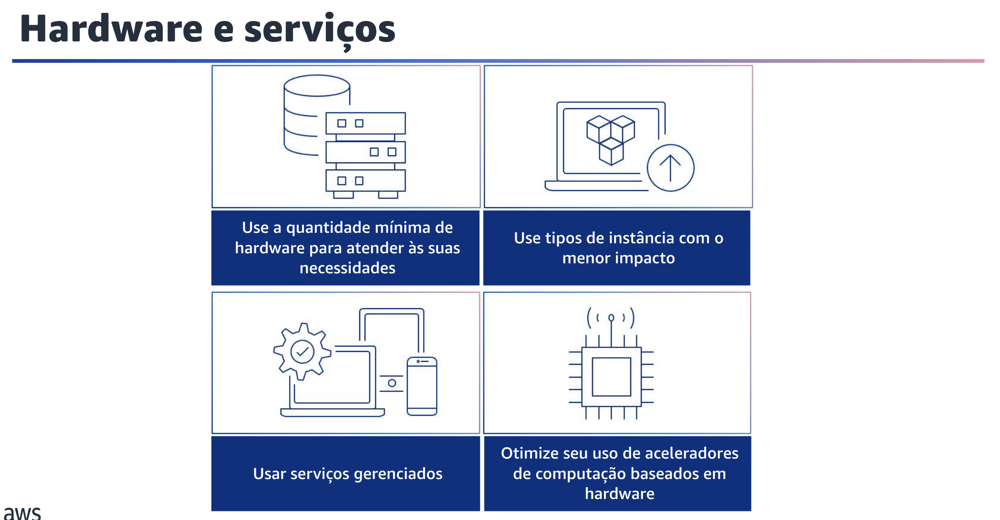
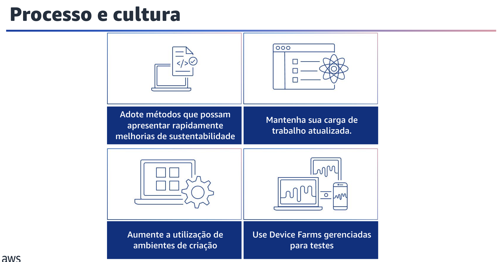

## 1.18 Hardware e serviços

A próxima área de práticas recomendadas em sustentabilidade é a de hardware e serviços.

## 1.19 Hardware e serviços

Procure oportunidades para reduzir os impactos de sustentabilidade da carga de trabalho fazendo alterações em suas práticas de gerenciamento de hardware.

As práticas recomendadas para considerar os padrões de hardware incluemo uso da quantidade mínima de hardware para atender às suas necessidades de forma eficiente e o uso de tipos de instância com o menor impacto.
Monitore e use continuamente novos tipos de instância para aproveitar as melhorias na eficiência energética.
Outra prática recomendada é usar serviços gerenciados para operar com mais eficiência na nuvem.

Além disso, otimize o uso de aceleradores de computação baseados em hardware para reduzir as demandas de infraestrutura física de sua carga de trabalho.

## 1.20 Processo e cultura

A última área de práticas recomendadas de sustentabilidade que você explorará é a de processo e cultura.

## 1.21 Processo e cultura

Procure oportunidades de reduzir seu impacto na sustentabilidade fazendo alterações em suas práticas de desenvolvimento, teste e implantação. Práticas recomendadas práticas incluem adotar métodos e processos para validar possíveis melhorias, minimizar os custos de testes e fornecer pequenas melhorias.

Você também deve manter sua carga de trabalho atualizada para adotar recursos eficientes, eliminar problemas e melhorar a eficiência geral de sua carga de trabalho.
Outra prática recomendada é aumentar a utilização de recursos para desenvolver, testar e criar suas cargas de trabalho.

Por fim, fim, use Device Farms gerenciadas para testar com eficiência um novo recurso em um conjunto representativo de hardware.
