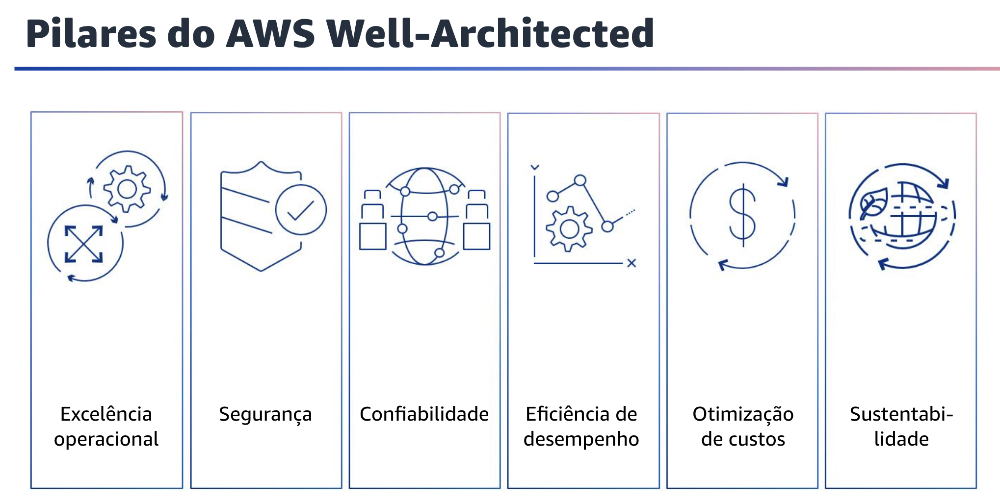
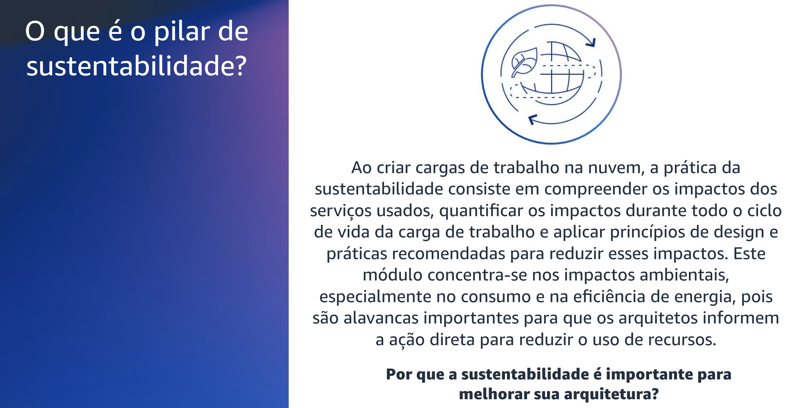

## 1.4 Pilares do AWS Well-Architected

Há seis pilares do Well-Architected Framework: excelência operacional, segurança, confiabilidade, eficiência de desempenho, otimização de custos e sustentabilidade.
Esses pilares são os fundamentos da arquitetura de suas soluções de tecnologia na nuvem. A sustentabilidade é o mais recente dos seis pilares.
Ele foi introduzido na estrutura em 2021 para ajudar os clientes a tomar decisões de sustentabilidade sobre suas cargas de trabalho.

Este módulo se concentrará no pilar de sustentabilidade.

## 1.5 O que é o pilar de sustentabilidade?

O que é o pilar de sustentabilidade?
O pilar de sustentabilidade aprimora o framework para fornecer uma maneira de medir consistentemente as arquiteturas em relação às práticas recomendadas de sustentabilidade e identificar áreas de melhoria, com foco na redução do consumo de energia das cargas de trabalho da AWS.
Ele contém perguntas destinadas a ajudar os clientes a avaliar o design, a arquitetura e a implementação de suas cargas de trabalho para reduzir o consumo de energia e melhorar a eficiência. Muito mais do que uma simples lista de verificação, ele foi projetado para ser uma ferramenta que os clientes podem usar para acompanhar seu progresso em direção a políticas e práticas recomendadas que apoiam um futuro mais sustentável.

O pilar se concentra nas práticas recomendadas de sustentabilidade, que são entender, quantificar e aplicar. Ao criar cargas de trabalho na nuvem, a prática da sustentabilidade consiste em compreender os impactos dos serviços usados, quantificar os impactos durante todo o ciclo de vida da carga de trabalho e aplicar princípios de design e práticas recomendadas para reduzir esses impactos.

Este módulo concentra-se nos impactos ambientais, especialmente no consumo e na eficiência de energia, pois são alavancas importantes para que os arquitetos informem a ação direta para reduzir o uso de recursos.

Ao pensar em sustentabilidade nas arquiteturas de seus clientes, é importante lembrar que a sustentabilidade é uma troca, assim como muitos dos outros pilares do AWS WellArchitected. Também é importante entender que, quando se trata de aprimorar as arquiteturas por meio da sustentabilidade, o modelo de responsabilidade compartilhada frequentemente usado na discussão de outros pilares também se aplica aqui.
A AWS é responsável por criar uma infraestrutura de nuvem que seja sustentável, e os clientes da AWS são responsáveis por aplicar as práticas recomendadas de arquitetura para a sustentabilidade em suas cargas de trabalho na nuvem.

Há vários motivos pelos quais a sustentabilidade pode ser uma consideração importante no aprimoramento das arquiteturas, incluindo: demanda dos clientes, regulamentações governamentais, demanda dos funcionários, investimento de impacto e sustentabilidade como posicionamento competitivo
