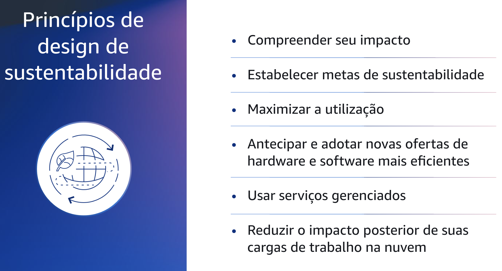

## 1.6 Sustentabilidade

Agora que você tem uma melhor compreensão do pilar de sustentabilidade, pode aprender mais sobre os componentes, começando com os princípios de design de sustentabilidade.

## 1.7 Princípios de design de sustentabilidade

Há seis princípios de design para a sustentabilidade na nuvem.
O primeiro princípio de design é compreender seu impacto. Meça o impacto de sua carga de trabalho na nuvem e modele o impacto futuro. Inclua todas as fontes de impacto, inclusive aquelas resultantes do uso de seus produtos pelo cliente e aquelas resultantes de sua eventual desativação e retirada.
Compare a saída da produção com o impacto total de suas cargas de trabalho na nuvem revisando os recursos e as emissões necessárias por unidade de trabalho.
Use esses dados para estabelecer KPIs, avaliar maneiras de melhorar a produtividade e, ao mesmo tempo, reduzir o impacto e estimar o impacto das mudanças propostas ao longo do tempo.

Estabeleça metas de sustentabilidade de longo prazo, como a redução dos recursos de computação e armazenamento necessários por transação.
Modele o retorno do investimento de melhorias na sustentabilidade para as cargas de trabalho existentes, e forneça aos proprietários os recursos necessários para investir nas metas de sustentabilidade.
Você também deve planejar o crescimento e arquitetar suas cargas de trabalho para que o crescimento resulte em uma intensidade de impacto reduzida, medida em relação a uma unidade apropriada, como por usuário ou por transação.

As metas ajudam a apoiar as metas de sustentabilidade mais amplas de sua empresa ou organização, a identificar regressões e a priorizar áreas com potencial de melhoria.

Para maximizar a utilização, você pode dimensionar as cargas de trabalho e implementar um design eficiente.
Isso pode ajudar a garantir uma alta utilização e a maximizar a eficiência energética do hardware subjacente. Dois hosts executados com 30% de utilização são menos eficientes do que um host executado com 60% devido ao consumo de energia da linha de base por host.
Ao mesmo tempo, elimine ou minimize os recursos, o processamento e o armazenamento ociosos para reduzir a energia total necessária para alimentar sua carga de trabalho.

Você também deve antecipar e adotar novas ofertas de hardware e software mais eficientes.
Apoie os aprimoramentos a montante que seus parceiros e fornecedores fazem para ajudá-lo a reduzir o impacto de suas cargas de trabalho na nuvem. Você pode monitorar e avaliar continuamente suas ofertas de software e projetar a flexibilidade para impulsionar a rápida adoção de novas tecnologias eficientes.

Outro princípio de design é usar serviços gerenciados. O compartilhamento de serviços em uma base de clientes ampla ajuda a maximizar a utilização de recursos, o que reduz a quantidade de infraestrutura necessária para proporcionar suporte a cargas de trabalho na nuvem.
Por exemplo, os clientes podem compartilhar o impacto dos componentes comuns do data center, como energia e rede, migrando as cargas de trabalho para a nuvem AWS e adotando serviços gerenciados, como o AWS Fargate para contêineres sem servidor, em que a AWS opera o dimensionamento e é responsável por sua operação eficiente.

Use serviços gerenciados que possam ajudar a minimizar o impacto, como mover automaticamente dados acessados com pouca frequência para o armazenamento frio com as configurações do Amazon S3 Lifecycle ou o Amazon EC2 Auto Scaling para ajustar a capacidade para atender à demanda.

Reduza o impacto downstream de suas cargas de trabalho na nuvem, diminuindo a quantidade de energia ou recursos necessários para usar seus serviços, facilite ou elimine a necessidade de os clientes atualizarem seus dispositivos para usar seus serviços.
Você pode testar usando device farms para entender o impacto esperado e testar com os clientes para entender o impacto real do uso de seus serviços.
