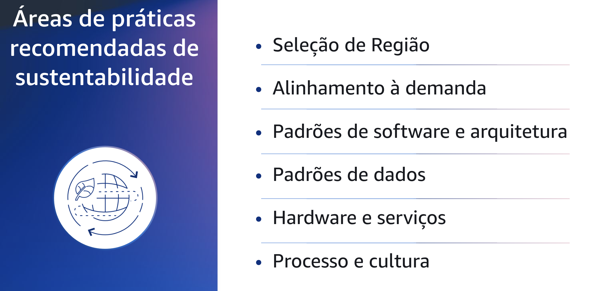
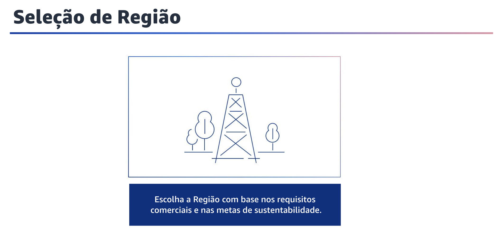
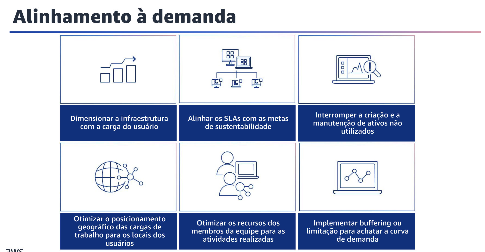
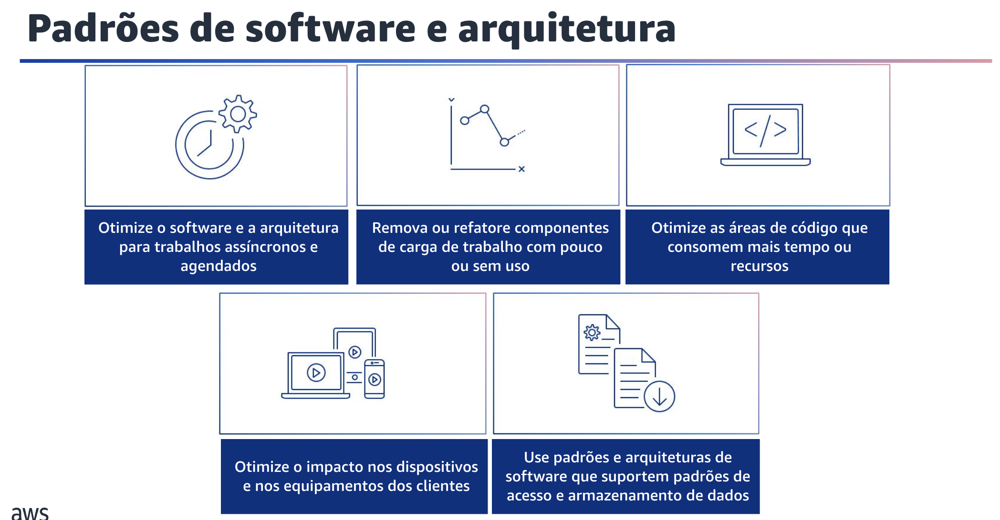

## 1.8 Sustentabilidade

Agora que você entende os princípios de design de sustentabilidade, você se aprofundará ainda mais nas práticas recomendadas de sustentabilidade.

## 1.9 Áreas de práticas recomendadas de sustentabilidade

Além dos princípios de design, há também seis áreas de práticas recomendadas nas quais se concentrar ao trabalhar para implementar a sustentabilidade na nuvem.
Essas áreas de práticas recomendadas são:

- seleção de Região;
- alinhamento à demanda;
- padrões de software e arquitetura;
- padrões de dados;
- hardware e serviços;
- além de processo e cultura.
No restante deste módulo, você se aprofundará em cada uma dessas áreas de práticas recomendadas.

## 1.10 Seleção de Região

A seleção de Região é a primeira área de práticas recomendadas de sustentabilidade que você explorará.

## 1.11 Seleção de Região

A escolha da Região para sua carga de trabalho afeta significativamente seus KPIs, inclusive o desempenho, o custo e a pegada de carbono. Para melhorar efetivamente esses KPIs, você deve escolher Regiões para suas cargas de trabalho com base nos requisitos de negócios e nas metas de sustentabilidade.

## 1.12 Alinhamento à demanda

A próxima área de práticas recomendadas em sustentabilidade sobre a qual você aprenderá é o alinhamento à demanda.

## 1.13 Alinhamento à demanda

A maneira como os usuários consomem suas cargas de trabalho e outros recursos pode ajudá-lo a identificar melhorias para atender às metas de sustentabilidade. Uma maneira de fazer isso é dimensionar a infraestrutura para corresponder continuamente à carga do usuário e garantir que apenas os recursos mínimos necessários para dar suporte aos usuários sejam implantados.

Usando a elasticidade da nuvem, você pode dimensionar sua infraestrutura dinamicamente para adequar o fornecimento de recursos de nuvem à demanda e evitar o excesso de provisionamento de capacidade em sua carga de trabalho.

Você também pode alinhar os SLAs com as metas de sustentabilidade. Para fazer isso,revise e otimize os SLAs de carga de trabalho com base em suas metas de sustentabilidade para minimizar os recursos necessários para dar suporte à sua carga de trabalho e, ao mesmo tempo, continuar atendendo às necessidades dos negócios.

Outra maneira de considerar o alinhamento à demanda é parar de criar e manter ativos não utilizados. Desative ativos não utilizados em sua carga de trabalho para reduzir o número de recursos de nuvem necessários para atender à sua demanda e minimizar o desperdício.

Otimize o posicionamento geográfico das cargas de trabalho reduzindo a distância que o tráfego de rede deve percorrer e diminuindo o total de recursos de rede necessários para dar suporte à sua carga de trabalho.

Otimize os recursos dos membros da equipe para minimizar o impacto da sustentabilidade ambiental e, ao mesmo tempo, atender às necessidades deles.

Implemente buffering ou limitação para achatar a curva de demanda e reduzir a capacidade provisionada necessária para sua carga de trabalho.

## 1.14 Padrões de software e arquitetura

A próxima área de práticas recomendadas em sustentabilidade é a de padrões de software e arquitetura.

## 1.15 Padrões de software e arquitetura

Existem algumas práticas recomendadas para considerar os padrões de comportamento. Primeiro,otimize o software e a arquitetura para trabalhos assíncronos e agendados. Use padrões eficientes de software e arquitetura, como os orientados por filas, para manter uma utilização alta e consistente dos recursos implantados.

Outra prática recomendada é remover ou refatorar componentes de carga de trabalho com pouco ou nenhum uso. Você pode remover componentes que não são usados e não são mais necessários e refatorar componentes com pouca utilização para minimizar o desperdício em sua carga de trabalho.

Além disso, otimize as áreas de código que consomem mais tempo ou recursos Você pode otimizar o código que é executado em diferentes componentes da sua arquitetura para minimizar o uso de recursos e, ao mesmo tempo, maximizar o desempenho.

Otimize o impacto nos dispositivos e nos equipamentos dos clientes compreendendo como eles são usados em sua arquitetura e empregando estratégias para reduzir o uso deles. Isso pode minimizar o impacto ambiental geral de sua carga de trabalho na nuvem.

A última prática recomendada é usar padrões e arquiteturas de software que melhor suportem os padrões de acesso e armazenamento de dados. Entenda como os dados são usados em sua carga de trabalho, consumidos por seus usuários, transferidos e armazenados. Você pode usar padrões e arquiteturas de software que melhor suportem o acesso e o armazenamento de dados para minimizar os recursos de computação, rede e armazenamento necessários para suportar a carga de trabalho.
