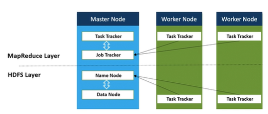

<!--
# 4. Armazenamento e Processamento Paralelo

## 4.1 - Introdução

## 4.2 - O Que é um Cluster de Computadores?

Um servidor é um computador, geralmente com alta capacidade computacional, que "serve"(fornece) serviços de armazenamento, aplicações ou bancos de dados.
Um servidor possui escalabilidade vertical, ou seja, há um limite até onde conseguimos incluir mais espaço em disco, mais processadores e mais memoria RAM.

Um Cluster de computadores é um conjunto de servidores com um mesmo propósito visando fornecer um tipo de serviço, como armazenamneto ou processamento de dados.

Um cluster possui escalabilidade horizintal, ou seja, se quisermos aumentar a capacidade computacional incluimos mais máquinas no cluster (além da escalabilidade vertical de cada máquina individual no cluster)

## 4.3 - O Que é Armazenamento Paralelo?

Com clusters de computadores aumentamos de forma considerável a capacidade computacional.

O armazenamneto paralelo consiste em distribuir o armazenamneto de dados através de diversos servidores (computadores). o que permite aumentar de forma considerável a capacidade de armazenamneto usando hardware de baixo custo.

## 4.4 - Software para Armazenamento Paralelo - Apache Hadoop - Parte 1/2

E como gerenciamos o armazenamneto paralelo através de diversos computadores?
- Precisamos de um sistema de arquivo distribuido. Seu computador tem um sistema de arquivos(NTFS, ext3, etc..), mas ele nao foi desenvolvido para armazenamneto distribuido.

Entre algumas opções, o Apache Hadoop HDFS (?Hadoop Distributes File System) tem se mostrado a solução ideal para gerenciar o armazenamento distribuido em um cluster de computadores.

## 4.5 - Software para Armazenamento Paralelo - Apache Hadoop - Parte 2/2

O HDFS é o software responsavek pela gestao do cluster de computadores definindo como os arquivos serao distribuidos através do cluster
Com HDFS podemos construir um Data Lake que roda sobre um cluster de computadores e permite o armazenamneto de grandes volumes de dados com hardware commodity (de baixo custo).
Isso permitiu que o BigData podesse ser usado em larga escala.

## 4.6 - Processamento Paralelo de Big Data

No processamento paralelo o objetivo é dividir uma tarefa em várias sub-tarefas e executá-las em paralelo.
O Apache Hadoop MapReduce e o Apache Spark sao dois frameworks para esse propósito.

Ao usar um frameworks de processameno paralelo, as sub-tarefas sao levadas para o processador da máquina do cluster onde os dados estao armazenados, aumentando assim a velocidade de processamneto de grandes volumes de dados.

## 4.7 - Arquitetura de Armazenamento e Processamento Paralelo

O HDFS é um serviço rodando em todas as máquinas do cluster, sendo um NameNode para gerenciar o cluster e os DataNodes que fazem o trabalho de armazenamnero propriamente dito.

O MapReduce também é um serviço rodando em todas as máquinas do cluster, sendo um Job Tracker para gerenciar o processamento e os Task Trackers que fazem o traballho de processamento.

O Job Tracker consulta o NameNode a fim de saber a localização dos blocos de dados nas máquinas do cluster.
Essa arquitetura permite armazenar e processar grandes quantidades de dados e assim extrair valor do Big Data através da análise de dados.

## 4.8 - Soluções de Armazenamento e Processamento Paralelo - Parte 1/2

- Apache Hadoop
- Cloudera

## 4.9 - Soluções de Armazenamento e Processamento Paralelo - Parte 2/2

- Azure HDInsight
- Amazon EMR
- Databricks
