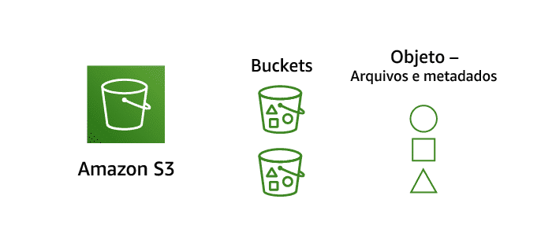
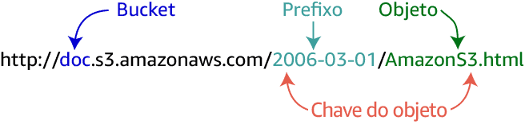
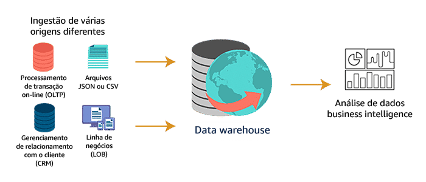
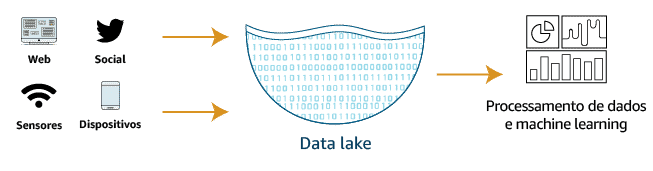

<!--
# Volume - Quando as empresas têm *mais dados* do que conseguem *processar e analisar*, elas têm um *problema de volume*.

É isso aí! Vamos falar sobre Volume.

Nós acabamos de discutir os 5 Vs da Análise de Dados e os desafios que surgem com eles. O Volume de dados é o primeiro desafio. Há muitas empresas com dificuldades em lidar com quantidades massivas de dados.

É verdade! Geramos dados em grandes volumes, praticamente todos têm um tablet, um celular, um laptop. As pessoas geram toneladas de dados todos os dias. - Você tem um smartwatch?

- Sim! Eu tenho e adoro! Eu não trouxe ele hoje, mas quando está comigo, me diz quantos passos eu dei, como ficou a minha frequência cardíaca, ele até permite que eu verifique meus e-mails e atenda chamadas.

Nossa! A praticidade é incrível! Mas pense nisso num ponto de vista dos dados. Seu dispositivo coleta dados constantemente e envia aos servidores para processar cada passo e cada verificação de frequência cardíaca. Em seguida, eles retornam os resultados para o dispositivo para que você e, somente você, possa ver sempre que quiser.

Esse é apenas um exemplo de um conjunto inteiro de dispositivos classificado como: Internet das Coisas ou IoT. As empresas de IoT obtêm uma imensidão de informações de dispositivos como estes. E não param por aí. As mídias sociais mudaram a maneira como as empresas comercializam os produtos delas e para os clientes. Isso mudou a maneira como elas lidam com as reclamações e até mesmo com o atendimento ao cliente. Você pode imaginar a quantidade de dados gerados e carregados a cada minuto, apenas por meio das mídias sociais?

Eu tenho certeza que são quantidades muito, muito grandes!

Eu li recentemente que mais de 100 milhões de e-mails de spam são enviados a cada minuto e outra coisa, os usuários da Netflix consomem mais de 70 mil horas de vídeo a cada minuto.

E no YouTube? Os usuários assistem a mais de 4 milhões de vídeos a cada minuto.

A International Data Corporation, também chamada de IDC, prevê um crescimento massivo de dados entre agora e 2025. A corporação prevê que a Global DataSphere, que são os dados coletados de todos os lugares, crescerá de 33 zetabytes no ano passado para 175 zetabytes até 2025.

Zetabytes?! Isso dá… São 21 zeros!? Pelo que eu me lembro, apenas alguns anos atrás, as previsões ainda estavam na faixa dos hexabites. Quem imaginaria que chegaríamos a este ponto? Então, o que esse rápido aumento no volume de dados significa para os responsáveis pelas tomadas de decisões nos negócios?

Isso significa que eles precisam de soluções de análise de dados. Em primeiro lugar, as empresas gerenciam um volume passivo de dados e devem trabalhar com eficiência em sistemas distribuídos, mesmo naqueles que abrangem países ou continentes. E essas soluções devem ser facilmente escaláveis, para que elas possam acomodar enormes picos de volume e de tráfego.

Vou resumir isso. Uma solução para analisar dados tem que suportar enormes quantidades de dados. Portanto, precisa possuir um armazenamento que seja escalável e durável e precisa ser capaz de coletar esses dados de muitas fontes diferentes.

Este seria um bom ponto para discutirmos os diferentes tipos de dados que, talvez, precisem ser analisados.

Exatamente! Primeiro, vamos usar dados relacionais ou estruturados. Esses dados normalmente são armazenados em bancos de dados relacionais. Né? Daí o nome. Eles são estruturados por regras e constraints definidas no próprio banco de dados. Esse tipo de dados é espinha dorsal de aplicações transacionais.

Em segundo lugar, os dados semiestruturados. Esses dados, geralmente, são armazenados no banco de dados não relacional, ou também chamado de NoSQL, ou até mesmo em arquivos de JSON ou XML. Esses dados não têm uma estrutura rígida e muitas vezes, por sua própria natureza, são temporários. Os exemplos incluem movimentos que você faz em um videogame on-line, por exemplo, o cache do navegador da internet ou até mesmo aplicativos de redes sociais que excluem automaticamente suas publicações após um determinado período.

E, finalmente, aos dados não estruturados. Esses dados, geralmente, possuem a forma de arquivos ou objetos, não têm uma estrutura única e representam todo o resto que uma empresa coleta e gera. Esses dados geralmente são considerados intocáveis porque não atendem às normas convencionais. Eles exigem a criação de tags e precisam ser catalogados pra serem analisados, o que impede que muitas empresas utilizem suas soluções de Data Analytics. Eu sei que às vezes parece difícil entender o que significa dados não estruturados. Então, aqui vão alguns exemplos pra vocês. Poderiam ser: imagens, mensagens de e-mail, arquivos de texto, conteúdos de mídias sociais, mensagens de texto e vídeo.

Eu ouvi dizer que apenas 10% de todos os dados coletados ou gerados pelas empresas são estruturados. - É verdade?

- Sim! Vários artigos foram escritos em estudos realizados sobre esse mesmo problema. Esses dados, que são os mais simples de incorporar em soluções de análise de dados, representam apenas uma pequena porcentagem dos dados que realmente estão sendo coletados. Um pouco chocante perceber isso.

Nossa! Eu ouvi dizer que há outros 10% de todos os dados coletados ou gerados por empresas, são dados semiestruturados. E o restante? Os outros 80%, são dados não estruturados. Em outras palavras, a maior parte dos dados de sua empresa também é a mais difícil de analisar. Muitas vezes, as empresas enfrentam dificuldades para criar soluções de análise de dados que podem extrair com precisão e eficácia esses dados valiosos para produzirem insights significativos. Às vezes, parece que os dados estão congelados nos servidores de arquivos e muitos são difíceis de entender. Mas não precisa ser assim. Apresentaremos algumas soluções excelentes, mais adiante neste curso.

No próximo tópico, discutiremos como armazenar todos esses dados.

## Crescimento exponencial de dados de negócios

As empresas armazenam dados há décadas, isso não é novidade. O que mudou nos últimos anos foi a capacidade de analisar determinados tipos de dados.

Há três classificações amplas de tipos de origem dos dados:

Dados estruturados são organizados e armazenados na forma de valores que são agrupados em linhas e colunas de uma tabela.
Dados semiestruturados muitas vezes são armazenados em conjuntos de pares de chave-valor que são agrupados em elementos em um arquivo.
Dados não estruturados não são estruturados de forma consistente. Alguns dados podem ter uma estrutura semelhante a dados semiestruturados, mas outros podem conter apenas metadados.
Muitos artigos da internet falam muito da enorme quantidade de informações presente em dados não estruturados. Novos aplicativos são lançados que agora podem catalogar e fornecer informações incríveis sobre esse recurso inexplorado.

Mas o que são dados não estruturados? Eles estão em todos os arquivos que armazenamos, todas as fotos que tiramos e e‑mails que enviamos.

<!--Adaptado do artigo: https://www.datamation.com/big-data/structured-vs-unstructured-data.html -->

Os conjuntos de dados estão cada vez **maiores** e **mais diversificados** a cada dia.

Plataformas modernas de gerenciamento de dados devem capturar dados de diversas fontes em velocidade e escala. Os dados precisam ser reunidos em repositórios gerenciáveis e centrais, dividindo os silos tradicionais. Os benefícios da coleta e avaliação de todos os dados de negócios devem superar os custos.

# Tópico 1: Introdução ao Amazon S3
As soluções de avaliação de dados podem ingerir dados de praticamente qualquer lugar. No entanto, quanto mais próximo os dados estiverem do sistema de processamento, melhor será o desempenho desse sistema. Na AWS, o Amazon Simple Storage Service (Amazon S3) é o melhor lugar para armazenar todos os seus dados semiestruturados e não estruturados.

No último vídeo, eu prometi que falaríamos sobre maneiras de armazenar dados de todos os tipos. Tudo começa entendendo os componentes de uma solução de análise de dados, de Data Analytics.

O armazenamento é uma grande parte dessas soluções. Você precisa armazenar os dados coletados em algum lugar, certo? E você também precisa armazenar dados temporariamente enquanto eles estão sendo processados. Depois, você precisa armazenar os resultados de uma maneira que os torne acessíveis pras pessoas que precisam vê-los.

O ponto crucial de qualquer boa solução é uma boa plataforma de armazenamento. A AWS tem um serviço de armazenamento chamado de Amazon Simple Storage Service ou Amazon S3,de forma abreviada. Esse serviço é um serviço de armazenamento de objetos, o que significa que você pode armazenar praticamente qualquer tipo de objeto com dados dentro dele. Um objeto é como o Amazon S3 se refere a arquivos. É um serviço poderoso. Ele é escalável e pode chegar ao tamanho que você precisar. É durável; e o que significa isso? Significa que seus arquivos estarão lá quando você precisar deles. Ele implementa a escalabilidade, segurança e performance líderes do setor. As pessoas usam o Amazon S3 para sites, aplicativos para dispositivos móveis e Data Analytics.

Veja como funciona. Ao começar a usar o Amazon S3, você cria buckets, ok? Eles são como pastas de arquivos, só que maiores, melhor organizados e com mais mecanismos de segurança. Em seguida, você move os dados para os buckets. A AWS oferece várias maneiras de fazer isso, não importando o tamanho do volume. Você pode mover até exabytes de uma só vez. Você encontrará vários links abaixo pra te ajudar a entender melhor as opções que estão disponíveis.

Lembre-se de que o armazenamento é implícito em toda solução de análise de dados. Há três principais maneiras de implementar o Amazon S3 como sua solução de armazenamento, que podem melhorar sua solução de análise de dados de alto volume.

Na primeira, com o Amazon S3, você pode separar a maneira como armazena os dados da maneira como os processa. Isso é conhecido como: desacoplar o armazenamento do processamento. Você pode ter buckets separados para os dados brutos, resultados de processamento temporários e resultados finais.

A segunda maneira é a paralelização. Com Amazon S3, você pode acessar qualquer um desses locais de armazenamento de um processo, em paralelo, sem afetar negativamente os outros processos. Por fim, o Amazon S3 torna-se o local central para armazenar conjunto de dados analíticos, fornecendo acesso a vários processos analíticos ao mesmo tempo. Isso permite que a solução evite o processo longo de movimentação de dados entre o sistema de armazenamento e o sistema de processamento.

O Amazon S3 é uma ótima solução pra atender as necessidades de armazenamento da sua solução de análise de dados. No próximo tópico falaremos sobre como o S3 organiza os dados.

# Armazenamento de arquivos da AWS
## Necessidade do Cliente
Imagine uma empresa que implementou o Amazon QuickSight como uma ferramenta de visualização de dados. Quando essa ferramenta depende de dados armazenados fisicamente, latência pode ser adicionada ao processamento. Essa latência pode se tornar um problema para os usuários. Outra preocupação comum é a capacidade de um usuário reunir os conjuntos de dados corretos para executar a análise necessária.

## A Opção AWS
O Amazon S3 é o armazenamento para a internet. Esse serviço foi projetado para facilitar a computação em escala web para os desenvolvedores. O Amazon S3 fornece uma interface simples de serviços da web que pode ser usada para armazenar e recuperar qualquer quantidade de dados, a qualquer momento e a partir de qualquer lugar. O serviço concede acesso a todos os desenvolvedores à mesma infraestrutura altamente escalável, confiável, segura, rápida e econômica que a Amazon utiliza para executar sua própria rede global de sites. O serviço tem como objetivo maximizar os benefícios de escala e repassar esses benefícios para os desenvolvedores.

Os benefícios do Amazon S3 são:
- Armazenamento de qualquer coisa;
- Armazenamento seguro de objetos;
- Acesso HTTP nativamente on-line;
- Escalabilidade ilimitada; 
- Durabilidade de 99,999999999%.

## Conceito do Amazon S3
Para aproveitar ao máximo o Amazon S3, você precisa entender alguns conceitos simples. Em primeiro lugar, o Amazon S3 armazena dados como objetos em buckets.

Um *objeto* é composto por um arquivo e quaisquer metadados que descrevam esse arquivo. Para armazenar um objeto no Amazon S3, você faz o upload do arquivo que deseja armazenar no bucket. Ao fazer o upload de um arquivo, você pode definir permissões no objeto e adicionar metadados.

***Buckets*** são contêineres lógicos para objetos. Você pode ter um ou mais buckets em sua conta e controlar o acesso a cada um individualmente. Você controla quem pode criar, excluir e listar objetos no bucket. Você também pode visualizar logs de acesso do bucket e seus objetos e escolher a região geográfica onde o Amazon S3 armazenará o bucket e o respectivo conteúdo.

### Acesso ao conteúdo

Depois que os objetos foram armazenados em um bucket do Amazon S3, eles recebem uma chave de objeto. Use isso, juntamente com o nome do bucket, para acessar o objeto.

Veja abaixo um exemplo de URL para um único objeto em um bucket chamado doc, com uma chave de objeto composta pelo prefixo 2006-03-01 e o arquivo nomeado AmazonS3.html.

Uma chave de objeto é um identificador exclusivo de um objeto em um bucket. Como a combinação de um bucket, chave e ID de versão identifica exclusivamente cada objeto, você pode considerar o Amazon S3 como um mapa de dados básico entre “bucket + chave + versão” e o próprio objeto. Cada objeto no Amazon S3 pode ser endereçado exclusivamente pela combinação de endpoint de serviço web, nome de bucket, da chave e, opcionalmente, a versão.

## Soluções de avaliação de dados no Amazon S3

Há muitas vantagens em usar o Amazon S3 como plataforma de armazenamento para sua solução de avaliação de dados.

- ### Desacoplamento entre o armazen. e o process. de dados e comput
    Com o Amazon S3, você pode armazenar de modo econômico todos os tipos de dados em seus respectivos formatos nativos. Em seguida, você pode executar quantos servidores virtuais forem necessários usando o Amazon Elastic Compute Cloud (Amazon EC2) e usar as ferramentas analíticas da AWS para processar seus dados. Você pode otimizar suas instâncias do EC2 para fornecer as proporções corretas de CPU, memória e largura de banda para obter melhor desempenho.

    Desacoplar seu processamento e armazenamento oferece muitos benefícios, incluindo a capacidade de processar e analisar os mesmos dados com diversas ferramentas.

- ### Arquitetura de dados centralizada
    O Amazon S3 facilita a criação de um ambiente multi-tenant em que muitos usuários podem trazer suas próprias ferramentas de análise de dados para um conjunto comum de dados. Isso melhora o custo e a governança de dados em relação às soluções tradicionais, que exigem que várias cópias de dados sejam distribuídas em múltiplas plataformas de processamento.

    Embora isso possa exigir uma etapa adicional para carregar seus dados na ferramenta certa, ter o Amazon S3 como seu datastore central oferecerá ainda mais benefícios em relação às opções de armazenamento tradicionais.

- ### Integração com serviços AWS sem cluster e sem servidor
    Combine o Amazon S3 com outros serviços AWS para consultar e processar dados. O Amazon S3 também se integra à computação sem servidor do AWS Lambda para executar código sem provisionar ou gerenciar servidores. O Amazon Athena pode consultar o Amazon S3 diretamente usando a linguagem de consulta estruturada (SQL), sem a necessidade de entrada de dados em um banco de dados relacional.

    Com todos esses recursos, você paga apenas pela quantidade de dados processados ou pelo tempo de computação consumido.

- ### Interfaces de programação de aplicativo (APIs) padronizadas
    As APIs REST são interfaces de programação comumente usadas para interagir com arquivos no Amazon S3. As APIs RESTful do Amazon S3 são simples, fáceis de usar e compatíveis com a maioria dos principais provedor independente de software (ISV) terceirizados, incluindo o Apache Hadoop e outros fornecedores de ferramentas analíticas líderes do mercado. Isso permite que os clientes tragam as ferramentas que já conhecem e com as quais estão mais confortáveis para ajudá-los a executar análises em dados no Amazon S3.

## Teste de conhecimento
Qual dos seguintes elementos faz parte de um URL de objeto do Amazon S3?

- [x] Chave do objeto
- [x] Bucket
- [ ] Chave de usuário
- [ ] Token de acesso

# Tópico 2: introdução a Data Lakes

Agora é hora de discutir como os dados são organizados neste serviço.

O Amazon S3 é um incrível container de objetos. Em qualquer bucket, você pode adicionar o conteúdo nele de forma ordenada e organizada ou, simplesmente jogar o que quiser de qualquer jeito nele. Portanto, não importa como os dados chegam lá, assim que eles estão armazenados, você precisa de uma maneira de organizá-los pra que possa encontrá-los quando necessário.

É aqui que os data lakes entram em ação. Um data lake é um conceito de arquitetura que ajuda você a gerenciar vários tipos de dados de fontes diferentes, tanto estruturados como não estruturados por meio de um único conjunto de ferramentas.

Ok, vamos lá! Como podemos criar nosso data lake? Um data lake pode utilizar buckets do Amazon S3 e podemos organizar os dados em categorias dentro dele. Não importa como os dados chegaram lá ou de que tipo eles são. Você pode armazenar dados estruturados e não estruturados de maneira eficaz em um data lake no Amazon S3. A AWS oferece um conjunto de ferramentas para gerenciar todo data lake sem tratar de cada bucket como objetos separados e não associados.

Muitas empresas acabam agrupando dados em vários locais separados de armazenamento. Chamamos isso de silos. Esses silos raramente são gerenciados e mantidos pela mesma equipe e isso pode ser problemático. As inconsistências na forma como os dados foram escritos, coletados, agregados ou filtrados, podem causar dificuldades quando comparados e combinados na fase de processamento e análise.

Por exemplo, uma equipe pode usar um campo de endereço para armazenar juntos, número e o nome da rua, enquanto outra equipe pode usar campos separados para o número da rua e o nome da rua. Quando esses conjuntos de dados, esses datasets, são combinados, haverá uma inconsistência na maneira na qual o endereço é armazenado. Isso dificultará muito a análise.

Mas quando se usa a data lakes, você pode dividir esses silos de dados e trazê-los para um único repositório central gerenciado por uma única equipe, o que irá fornecer uma única e consistente fonte da verdade. Como os dados podem ser armazenados em seu formato bruto, você não precisa convertê-los, agregá-los ou filtrá-los antes de armazenar. Em vez disso, você pode deixar todo esse pré processamento pro sistema que o processa, em vez do sistema que o armazena.

Em outras palavras, você não precisa transformar os dados para torná-los utilizáveis. Você mantém os dados em sua forma original. No entanto, eles chegam lá e eles foram gravados. Quando você está falando de exabytes de dados, você não pode se dar ao luxo de pré processar esses dados de todas as maneiras possíveis das quais possam ser necessárias para um estudo utilizável.

Vamos falar sobre ter uma única fonte de dados confiável. Quando falamos sobre precisão em relação aos dados, estamos nos referindo à confiabilidade dos dados. Esse dado é o que deveria ser? Esses dados foram alterados? Podemos validar as responsabilidades das alterações? Ao criar uma única fonte de dados confiável, estamos criando um conjunto de dados, neste caso, o data lake que pode ser utilizado para todos os processamentos e análise de dados. O bônus é que sabemos que ela é consistente e confiável. Isso é confiabilidade!

Então vamos juntar tudo. Sabemos que as empresas precisam acessar e analisar facilmente dados de várias maneiras, usando as ferramentas e frameworks de sua escolha. Lembre-se do segundo princípio que falamos no último tópico: a movimentação de dados em que armazenamento e processamento é custosa. Usar a Amazon S3 como um data lake permite que você tenha o seu armazenamento em um local centralizado, assim, suas soluções e ferramentas que necessitam analisar os dados podem fazer isso sem necessidade de movimentação.

No próximo tópico, discutiremos a natureza do armazenamento de dados em aplicações de processamento de dados.

Armazenar conteúdo empresarial sempre foi motivo de discórdia e, muitas vezes, de frustração em empresas de todos os tipos. O conteúdo deve ser armazenado em pastas? Devem ser usados prefixos e sufixos para identificar versões de arquivos? O conteúdo deve ser dividido por departamento ou especialidade? A lista é longa.

O problema decorre do fato de que muitas empresas começam a implementar sistemas de gerenciamento de documentos ou arquivos com boas intenções, mas não têm um planejamento ou uma infraestrutura disponível para manter a organização inicial de dados.

Por conta da extrema necessidade de organizar o volume cada vez maior de dados, os data lakes foram criados.

Um data lake é um *repositório centralizado* que permite armazenar dados *estruturados, semiestruturados e não estruturados* em qualquer escala.

- ### Movimento de dados on-premises
    Os data lakes permitem que você importe qualquer quantidade de dados. Os dados sçao coletados de várias fontes e movidos para o data lake em seu formato original.

    Esse processo permite escalar para dados de *qualquer tamanho*, enquanto *economiza tempo* com a definição de estruturas de dados, esquemas e transformações de dados.

- ### Movimentação de dados em tempo real
    Os data lakes permitem que você importe *qualquer quantidade de dados em tempo real*. Os dados podem ser coletados de várias origens de dados de fluxo e movidos para o data lake em seu formato original.

- ### Armazenamento e proteção (data lake)
    Os data lakes permitem que você *armazene dados relacionais* de locais como bancos de dados operacionais e aplicativos de linha de negócios e *dados não relacionais* de locais como aplicativos móveis, dispositivos da internet das coisas (IoT) e redes sociais.
    Os data lakes também permitem *entender quais dados estão* no data lake por meio de *crawling*, *catalogação* e *indexação de dados*.
    Por fim, os dados precisam estar em local seguro para garantir que seus *ativos de dados estejam protegidos*

- ### Machine Learning
    Os data lakes permitem às organizações *gerir diferentes tipos de informações*, incluindo relatórios sobre *dados históricos* e implementando *machine learning* onde *os modelos* são criados para prever os resultados prováveis e sugerir diversas ações prescritas para alcançar o resultado ideal.

- ### Análise
    Os data lakes permitem que várias funções em sua organização, como cientistas de dados, desenvolvedores de dados e analistas de negócios, acessem dados com sua *escolha de ferramentas e frameworks analíticos*
    Isso inclui *frameworks de código aberto* como Apache Hadoop, Presto e Apache Spark, e ofertas comerciais de *data warehouse* e provedores de *business intelligence*
    Os data lakes permitem que você execute a parte analítica *sem precisar mover os dados para um* sistema analitico separado.

Os data lakes prometem armazenar todos os dados de uma empresa em um único repositório. Você pode aproveitar os data lakes para armazenar grandes volumes de dados em vez de manter esses dados em data warehouses. Os data lakes, como os criados no Amazon S3, geralmente têm custo inferior às soluções especializadas de armazenamento de big data. Dessa forma, você paga apenas pelas soluções especializadas ao usá-las para processamento e análise, e não para armazenamento de longo prazo. Sua extração, transformação e carregamento (ETL) e o processo analítico ainda podem acessar esses dados para análise. 

Veja abaixo alguns dos benefícios dos data lakes. Clique em cada cartão para ver os cuidados necessários para garantir que você implemente o melhor data lake para a sua situação.

- Fonte única de confiança = Não deixe que seu data lake se torne um depósito de dados. Imponha a organização e a estrutura adequadas para todos os dados inseridos no data lake.

- Armazene qualquer tipo de dados, independentemente da estrutura = Verifique se os dados no data lake são relevantes e sejam utilizados. Treine os usuários no acesso dos dados e defina políticas de retenção para garantir que os dados permaneçam atualizados.

- Pode ser analisado usando inteligência artificial (IA) e machine learning = Descubra como usar os dados de novas maneiras. Não limite a análise ao estilo de data warehouse típico. Inteligência artificial e o machine learning oferecem informações significativas.

## Benefícios de um data lake na AWS

São uma solução de armazenamento de dados econômica. Você pode armazenar de forma durável uma quantidade quase ilimitada de dados usando o Amazon S3.
Implemente a segurança e a conformidade líderes do setor. A AWS usa rigorosos mecanismos de segurança, conformidade, privacidade e proteção de dados.

Permite que você aproveite muitas ferramentas diferentes de coleta e ingestão de dados para ingerir dados em seu data lake. Esses serviços incluem o Amazon Kinesis para dados de streaming e dispositivos AWS Snowball para grandes volumes de dados locais.

Ajudam você a categorizar e gerenciar seus dados de forma simples e eficiente. Use o AWS Glue para entender os dados dentro do seu data lake, prepará-los e carregá-los de forma confiável em datastores. Depois que o AWS Glue cataloga seus dados, eles são imediatamente pesquisáveis, podem ser consultados e estão disponíveis para processamento de ETL.

Ajuda você a transformar dados em informações significativas. Utilize o poder dos serviços analíticos criados para finalidades específicas em vários casos de uso, como avaliação interativa, processamento de dados usando o Apache Spark e o Apache Hadoop, data warehousing, análise em tempo real, análise operacional, painéis e visualizações.

## Amazon EMR e data lakes
As empresas começaram a perceber o poder dos data lakes. Elas podem colocar dados em um data lake e usar os frameworks de processamento distribuído de código aberto que preferirem, como os compatíveis com o Amazon EMR. O Apache Hadoop e o Spark são compatíveis com o Amazon EMR, que tem a capacidade de ajudar as empresas a implementar soluções de processamento de dados baseadas em data lakes do Amazon S3 de modo fácil, rápido e econômico.

## Preparação do data lake
Os cientistas de dados passam 60% do tempo fazendo a limpeza e
organização de dados e 19% coletando conjuntos de dados.

A preparação de dados é uma tarefa enorme. Não há respostas fáceis quando se trata de limpeza, transformação e coleta de dados para seu data lake. No entanto, há serviços que podem automatizar muitos desses processos demorados.

A configuração e o gerenciamento de data lakes atualmente podem envolver muitas tarefas manuais, complicadas e demoradas. Esse trabalho inclui carregar os dados, monitorar os fluxos de dados, configurar partições para os dados e ajustar a criptografia. Você também pode precisar reorganizar dados, deduplicá-los, combinar registros vinculados e auditar dados ao longo do tempo.

# Organização e curadoria de conteúdos da AWS

- #### Desafio de Negócios
    Imagine uma empresa que tenha milhões de arquivos armazenados em várias soluções de armazenamento físico baseadas em servidor e anexadas à rede. A empresa tem dificuldade para navegar em todos os locais e oferecer aos usuários acesso rápido e confiável a esse conteúdo, tanto localmente quanto na nuvem.
    

- #### A opção AWS
    Data lake na AWS: As ferramentas tradicionais de armazenamento e análise de dados não conseguem mais fornecer a agilidade e a flexibilidade necessárias para gerar informações empresariais relevantes. É por isso que muitas organizações estão mudando para uma arquitetura de data lake.

    Um data lake na AWS pode ajudar a:

    - Coletar e armazenar qualquer tipo de dados, em qualquer escala e com baixo custo;
    - Proteger os dados e evitar acesso não autorizado;
    - Catalogar, pesquisar e encontrar os dados relevantes em um repositório central;
    - Executar novos tipos de avaliação de dados com rapidez e facilidade;
    - Usar um amplo conjunto de mecanismos analíticos para análise única, streaming em tempo real, análise preditiva, IA e machine learning.

- #### Desafio de Negócio (2)
    Imagine uma empresa que tenha milhares de arquivos armazenados no Amazon S3. A empresa precisa de uma solução para automatizar tarefas comuns de preparação de dados e organizar os dados em um repositório seguro.
    

- #### A opção AWS (2)
    AWS Lake Formation (atualmente em demonstração)

    O AWS Lake Formation facilita a configuração de um data lake seguro em dias. Um data lake é um repositório centralizado, seguro e com curadoria que armazena todos os seus dados, tanto em sua forma original como preparados para avaliação. Um data lake permite dividir os silos de dados e combinar diferentes tipos de estudos analíticos para obter informações e orientar melhor as decisões de negócios. O AWS Lake Formation está apenas em fase de demonstração.
    

O AWS Lake Formation facilita a ingestão, limpeza, catalogação, transformação e proteção dos seus dados, além de disponibilizá-los para avaliação e machine learning. O Lake Formation oferece um console central no qual você pode descobrir origens dos dados, configurar trabalhos de transformação para mover dados para um data lake do Amazon S3, remover duplicações e combinar registros, catalogar dados para acesso por ferramentas analíticas, configurar políticas de segurança e acesso a dados e auditar e controlar o acesso dos serviços analíticos e de machine learning da AWS.

O Lake Formation configura automaticamente os serviços AWS básicos para garantir a conformidade com suas políticas definidas. Se você configurou trabalhos de transformação que abrangem os serviços AWS, o Lake Formation configura os fluxos, centraliza a orquestração e permite que você monitore a execução dos trabalhos.

## Teste de conhecimento
Quais dos itens a seguir descrevem o que é um data lake do Amazon S3 e o tipo de dados que podem ser armazenados?
- [x] Repositório centralizado
- [x] Dados semiestruturados e não estruturados
- [x] Dados estruturados
- [ ] Repositório descentralizado

Qual das opções a seguir descreve o AWS Lake Formation?
- [x] Serviço para organizar e fazer curadoria dados
- [x] Serviço para proteger dados em todo o data lake
- [x] Serviço para orquestrar trabalhos de transformação com outros serviços AWS
- [ ] Serviço para criar operações de ETL

# Tópico 3: Introdução aso métodos de armazenamento de dados

No último tópico discutimos data lakes no Amazon S3 e o armazenamento de objetos. Neste tópico, discutiremos o armazenamento de dados estruturados. Esse armazenamento é realizado por meio de bancos de dados. Vamos focar em um tipo específico de bancos de dados, um Data Warehouse, que é uma das soluções mais comuns de bancos de dados voltados à análise.

Os Data Warehouses, são usados como um sistema central para armazenar dados analíticos de várias fontes. Digamos que uma empresa tenha vários bancos de dados distintos, pois diferentes departamentos usam para monitorar coisas diferentes. E, tudo bem. Mas isso dificulta ter uma boa ideia do que está acontecendo em todos os departamentos de uma só vez.

Um Data Warehouse é um repositório central de dados estruturados de muitas fontes de dados. Esses dados são transformados, agregados e preparados antes de serem inseridos no Data Warehouse. Os dados dentro do Data Warehouse são usados para relatórios e análises de negócio.

Data Warehouses são bancos de dados que armazenam os dados transacionais em um formato que acomoda consultas grandes e complexas. Os Data Warehouses têm sido a espinha dorsal e business intelligence há décadas. De pequenas empresas com datasets relativamente pequenos a grandes empresas com exabytes de dados, você pode usar Data Warehouse para entender os seus dados.

Os Data Warehouses on-premises exigem um investimento significativo para planejar, configurar e manter. Para muitas pequenas empresas, isso não é uma opção. No entanto, a AWS fornece um serviço de Data Warehousing chamado de Amazon Redshift. O Amazon Redshift permite configurar e implantar um novo data warehouse em minutos. Ele foi criado para armazenar e consultar conjuntos de dados que variam de gigabytes a petabytes de tamanho.

Portanto, agora o que temos é o Amazon S3, que pode hospedar o Data lake e o Amazon Redshift, que pode hospedar um Data Warehouse. Mas, e se precisar consultar ambos os espaços?

Olha, acho que eu tenho uma solução para isso. É chamado de Amazon Redshift Spectrum. O Redshift Spectrum permite combinar seu Data lake e o seu Data Warehouse como se fosse uma única fonte de dados. Sem movimentação de dados, sem consultas com lógicas malucas, apenas consultas limpas de todos os seus dados. Então, agora é possível executar uma única consulta exabytes de dados.

Ok. Mudança de conceito! É mesmo! Vamos discutir alguns prós e contras sobre a hospedagem de um Data Warehouse on-premises, ao invés de hospedá-lo na nuvem. O maior benefício de um Data warehousing, independente da localização, é a recuperação rápida e centralizada de dados. Os Data Warehouses fornecem conjunto de dados agrupados que podem ser usados para uma variedade de necessidades de análise e de geração de relatórios. E isso permite que você gere insights empresariais oportunos que podenm ajudá-lo a tomar decisões melhores e mais rapidamente.

Data Warehouses tradicionais no on-premises, apresentam algumas desvantagens que podem ser significativas, como seu custo. Empresas menores podem não ter nem tempo, nem recursos pra comprar um hardware e o software necessários, configurar as regras e constraints pra manter os dados consistentes e executar as operações de extração, transformação e carregamento. O ETL - Extract, Transform and Load. E, ainda, há preocupações contínuas com manutenção e segurança. Além disso, há a questão da escalabilidade. Os Data Warehouses tradicionais geralmente não podem ser escalados pra atender as demandas imprevisíveis dos workloads, cargas de trabalho, desses negócios.

Portanto, usar o Amazon Redshift, uma solução de Data Warehouse baseada na nuvem, pode ajudar você a lidar com todas essas preocupações. Ele é nativo na nuvem e oferece performance até dez vezes maior, que pode ser alcançado com uma solução de Data Warehouse on-premises.

Mencionei análises de dados algumas vezes e quero ter certeza que abordamos completamente a conexão entre dados e armazenamento. Em uma solução tradicional de análise de dados on-premises, as operações de ETL coletam dados. Essas operações transformam os dados no formato necessário e os colocam no Data Warehouse de acordo com o agendamento. Em seguida, você executaria qualquer análise necessária nesse Data Warehouse relacional. Esses processos de análise são limitados aos dados dentro do Data Warehouse. No cenário atual de dados, essa é uma grande limitação, especialmente considerando a amplitude dos dados que estão disponíveis para as empresas.

Sem dúvida, aplicações empresariais geralmente armazenam dados em formatos CSV, XML e JSON. O Data lake, combinado com o Data Warehouse do Amazon Redshift, é uma maneira prática de complementar os dados armazenados no Data Warehouse. Você pode criar uma solução de análise de dados que abranja dados estruturados no Data Warehouse e dados semiestruturados armazenados em Data lake. Assim, todos os dados se tornam visíveis e disponíveis pra fazer relatórios e dashboards.

Outra vantagem importante do ecossistema da AWS é a capacidade de usar todo o conteúdo do Data lake para machine learning e análise de dados em tempo real, a fim de prever com precisão os resultados futuros.

Então, vamos recapitular um pouco antes de prosseguir. Discutimos várias recomendações para armazenamento de dados. Para armazenar objeto, recomendamos o Amazon S3. Para armazenar grandes volumes de dados, tanto os estruturados quanto não estruturados recomendamos a criação de um data lake na AWS.

Quando se trata de armazenar uma quantidade massiva de dados, pra efetuar análises complexas, recomendamos a utilização de um Data Warehouse no Amazon Redshift. E temos mais uma recomendação.

E isso é o processo de ETL, que gera os conjuntos de dados analíticos. No ecossistema da AWS há uma ferramenta para criar operações de ETL chamada Amazon EMR. O Amazon EMR é uma estrutura de trabalho gerenciada do Hadoop. Você se lembra que falamos anteriormente sobre o desafio de gerir grandes volumes de dados rapidamente e produzir insights na mesma velocidade? Bem, é isso que o Amazon EMR faz. O Hadoop é um framework de código aberto. Ele já existe há muito tempo e está bem estabelecido no mundo de processamento de dados.

Espera aí! Antes de continuarmos a falar sobre o que é o Hadoop, vamos usar um tempinho pra definir o que o Hadoop não é. O Hadoop não é um banco de dados. Nem é um substituto para sistemas de dados existentes. Também não se trata de uma aplicação única. Trata-se de um framework com diversas ferramentas que ajudam você a armazenar e processar dados. E seu armazenamento é temporário. Ele vai continuar ali enquanto você processa o dado. Por enquanto, vamos focar apenas nessa parte de armazenamento temporário deste framework.

O Hadoop oferece suporte a transferências rápidas de dados, o que significa que você pode acelerar o tempo de processamento para consultas complexas. Se você usar o Hadoop on-premises ou o Amazon EMR usará as mesmas ferramentas, com uma exceção importante: o Amazon EMR usa um sistema próprio de arquivos e isso significa que você pode usar o Data lake do Amazon S3 como armazenamento de dados. Portanto, não há necessidade de copiar os dados para o cluster, como teria que fazer com o Hadoop on-premises.

Então, o Amazon EMR File System, o EMRFS, pode catalogar dados dentro de um data lake no S3 e a partir do sistema de arquivos do Hadoop on-premises ao mesmo tempo. Agora, além de poder combinar dados do data lake com os dados do Data Warehouse, podemos combinar os dados do Hadoop nesse único armazenamento centralizado. Portanto, ele combina os benefícios de um Hadoop tradicional e do EMR te trazendo o melhor dos dois mundos. O armazenamento é a base de qualquer solução de análise de dados. É vital compreender as suas opções para que possa decidir qual método de armazenamento é o melhor para sua solução de análise de dados. Nessa lição, nós vimos armazenamento de objetos e os benefícios em criar um data lake para trazer dados de fontes diversas, com diferentes formatos em um local centralizado. Vimos também as vantagens e desvantagens de um armazenamento estruturado utilizando um Data Warehouse. Também cobrimos a importância sobre considerar a utilização de ETL. Na próxima lição, vamos falar sobre soluções de análise para alta velocidade.

À medida que o volume de dados aumentou, as opções para armazenar dados também cresceram. Métodos de armazenamento tradicionais, como data warehouses, ainda são muito populares e relevantes. No entanto, os data lakes tornaram-se mais populares recentemente. Essas novas opções podem confundir empresas que tentam ter prudência financeira e ao mesmo tempo ser tecnicamente relevantes.

Qual é melhor: data warehouses ou data lakes? Nenhum e ambos. São soluções diferentes que podem ser usadas em conjunto para manter data warehouses existentes enquanto aproveitam ao máximo os benefícios dos data lakes.

## Desafio de negócios
As empresas se perguntam: por quê? Por que devemos gastar muito tempo e dinheiro implementando um data lake quando já investimos tanto em um data warehouse? É importante lembrar que um data lake aumenta um data warehouse, mas não o substitui.

## Data warehouses
Um data warehouse é um repositório central de dados estruturados de muitas origens de dados. Esses dados são transformados, agregados e preparados para relatórios e avaliaçãos de negócios.

Um data warehouse é umrepositório central de informações provenientes de uma ou mais origens de dados. Os dados fluem para um data warehouse de sistemas transacionais, bancos de dados relacionais e outras fontes. Essas origens de dados podem incluir dados estruturados, semiestruturados e não estruturados. Essas origens de dados são transformadas em dados estruturados antes de serem armazenadas no data warehouse.

Os dados são armazenados no data warehouse usando um esquema. Um esquema define como os dados são armazenados em tabelas, colunas e linhas. O esquema impõe restrições nos dados para garantir a integridade deles. O processo de transformação muitas vezes envolve as etapas necessárias para fazer com que os dados da fonte estejam em conformidade com o esquema. Após a primeira ingestão bem-sucedida de dados no data warehouse, o processo de ingestão e transformação dos dados pode continuar em um ritmo regular.

Analistas de negócios, cientistas de dados e tomadores de decisão acessam os dados por ferramentas de business intelligence (BI), clientes SQL e outros aplicativos de análise. As empresas usam ferramentas de relatórios, painéis e análise para extrair informações dos dados, monitorar o desempenho dos negócios e corroborar a tomada de decisões. Essas ferramentas de relatórios, painéis e análises são alimentados por data warehouses, que armazenam dados com eficiência para minimizar a E/S e entregar resultados de consultas com velocidades altíssimas a centenas e milhares de usuários simultâneos.

## Data marts
 **SUBCONJ. DE UM DATA WAREHOUSE**

Data warehouses podem ser enormes. Analisar esses armazenamentos enormes de dados pode ser confuso. Muitas organizações precisam de uma maneira de limitar as tabelas para aquelas mais relevantes para a análise que os usuários executarão.

Um subconjunto de dados de um data warehouse é chamado de data mart. Os data marts se concentram em apenas um assunto ou uma área funcional. Um data warehouse pode conter todas as fontes relevantes para uma empresa, mas um data mart pode armazenar apenas as fontes de um único departamento. Como os data marts geralmente são uma cópia dos dados já contidos em um data warehouse, eles geralmente são rápidos e simples de implementar.

### Data warehousing tradicional: vantagens e desvantagens
Vantagens | Desvantagens
-| -
Rápida recuperação de dados | Custo elevado para implementar
Conjuntos de dados com curadoria | Manutenção pode ser desafiadora
Armazenamento centralizado | Preocupações com segurança
Melhor business intelligence | Dificuldade de escalar para atender à demanda

### Benefícios do Amazon Redshift
É aqui que o Amazon Redshift entra. O Amazon Redshift supera todos esses pontos negativos oferecendo um ambiente baseado na nuvem, escalável e seguro para seu data warehouse. É fácil configurar, implantar e gerenciar o Amazon Redshift, sendo que ele oferece desempenho até 10 vezes mais rápido do que outras soluções de data warehousing.

**Benefícios do Amazon Redshift**
- Desempenho mais rápido =  10 vezes mais rápido do que outros data warehouses
- Fácil de configurar, implantar e gerenciar
- Seguro
- Escala rapidamente para atender às suas necessidades

## Comparação entre data warehouses e data lakes

- **ANÁLISE DE UM DATA WAREHOUSE**

    Para que a avaliação seja mais eficaz, ela deve ser feita em dados que foram processados e limpos. Isso muitas vezes significa implementar uma operação de ETL para coletar, limpar e transformar os dados. Esses dados são então colocados em um data warehouse. É muito comum que dados de várias partes diferentes da organização sejam combinados em um único data warehouse.

    O Amazon Redshift é uma solução de data warehousing especialmente projetada para cargas de trabalho de todos os tamanhos. O Amazon Redshift Spectrum ainda oferece a capacidade de consultar dados hospedados em um data lake do Amazon S3.

- **ANÁLISE DE UM DATA LAKE**

    ***Data lakes são a extensão dos data warehouses***
    
    Os data lakes fornecem aos clientes um meio de incluir dados não estruturados e semiestruturados em sua análise. As consultas analíticas podem ser executadas em dados catalogados em um data lake. Isso amplia o alcance da análise para além dos limites de um único data warehouse.
    
    As empresas podem armazenar com segurança dados provenientes de aplicativos e dispositivos em seu formato nativo, com alta disponibilidade, durabilidade, baixo custo e em qualquer escala. As empresas podem acessar e analisar dados facilmente de várias maneiras usando as ferramentas e os frameworks de sua escolha, com alto desempenho e de forma econômica, sem precisar mover grandes quantidades de dados entre sistemas de armazenamento e análise.

- **AWS: DATA LAKES E ANÁLISES**

    A AWS fornece um portfólio abrangente de serviços que permitem que os clientes criem seus data lakes na nuvem e analisem todos os seus dados com o mais amplo conjunto de estratégias analíticas, incluindo machine learning.

    Como resultado, há mais organizações executando seus data lakes e análises na AWS do que em qualquer outro lugar.

    

## COMPARATIVO

Características | Data warehouse | Data lake
-|-|-
Dados | Relacionais provenientes de sistemas transacionais, bancos de dados operacionais e aplicativos de linha de negócios | Não relacionais e relacionais de dispositivos IoT, sites, aplicativos móveis, redes sociais e aplicativos corporativos
Esquema | Projetado antes da implementação (Esquema na gravação) | Escrito no momento da avaliação (Esquema na leitura)
Preço/desempenho | Resultados de consulta cada vez mais rápidos usando armazenamento de baixo custo | Resultados de consulta obtidos mais rapidamente usando armazenamento de baixo custo
Qualidade dos dados | Dados com alta curadoria que servem como a versão central de confiabilidade | Quaisquer dados, que podem ou não ter curadoria (por exemplo, dados brutos)
Usuários | Analistas de negócios | Cientistas de dados, desenvolvedores de dados e analistas de negócios (usando dados com curadoria)
Análise | Relatórios de batches, business intelligence e visualizações | Machine learning, análise preditiva, descoberta de dados e criação de perfis

## Armazenamento de dados em GRANDE escala

Discutimos várias recomendações para armazenar dados: 

Ao armazenar objetos ou arquivos individuais, recomendamos o Amazon S3.
Ao armazenar volumes massivos de dados, semiestruturados e não estruturados, recomendamos a criação de um data lake no Amazon S3.
Ao armazenar grandes quantidades de dados estruturados para avaliaçãos complexas, recomendamos armazenar seus dados no Amazon Redshift.

## Do armazenamento ao processamento

Cada um dos serviços AWS de processamento que abordaremos na próxima lição incorpora uma camada de armazenamento temporário que armazena dados enquanto eles estão sendo processados e analisados. Esses dados são eventualmente movidos para um armazenamento permanente em uma das outras soluções que já discutimos.

### Desafio de Negócios
    As empresas precisam de uma solução que possa capturar dados, localizar padrões e agregar os dados para produzir informações valiosas. A solução deve fazer isso de modo que não sobrecarregue recursos corporativos e talentos. Os resultados desse processo devem ser colocados em um local centralizado que todos os funcionários possam acessar de forma segura de qualquer lugar do mundo.

Quando muitas pessoas pensam em trabalhar com um volume enorme de dados em constante movimentação, a primeira coisa que vem à mente é o Hadoop. Na AWS, os frameworks Hadoop são implementados usando o Amazon EMR e o AWS Glue. Esses serviços implementam o framework Hadoop para consumir, transformar, analisar e mover resultados para datastores analíticos.

## Apache Hadoop

O Hadoop usa uma arquitetura de processamento distribuído, no qual uma tarefa é mapeada para um cluster de servidores convencionais para processamento. Cada bloco de trabalho distribuído aos servidores do cluster pode ser executado ou re-executado em qualquer um dos servidores. Os servidores do cluster usam frequentemente o **Hadoop Distributed File System (HDFS)** para armazenar dados localmente para processamento. Os resultados da computação realizada pelos servidores são reduzidos a um único conjunto de saída. Um nó, designado como nó principal, controla a distribuição de tarefas e pode lidar automaticamente com falhas dos servidores.

## Implementação do Hadoop com o Amazon EMR

O Amazon EMR é o serviço AWS que implementa frameworks Hadoop. O serviço fará a ingestão dos dados de praticamente qualquer tipo de origem a praticamente qualquer velocidade! O Amazon EMR consegue implementar dois sistemas de arquivos diferentes: HDFS ou Elastic MapReduce File System (EMRFS). Um sistema de arquivos é um conjunto de regras organizacionais que controlam como os arquivos são armazenados. 

## HDFS
Para lidar rapidamente com volumes enormes de dados, o sistema de processamento exigia uma maneira de distribuir a carga de leitura e gravação de arquivos em dezenas ou até centenas de servidores de alta capacidade. O HDFS éum armazenamento distribuído que permite que os arquivos sejam lidos e gravados em clusters de servidores em paralelo. Isso reduz drasticamente a duração total de cada operação.

É útil compreender o funcionamento interno de um cluster do HDFS. Um cluster do HDFS consiste primariamente em um NameNode, que gerencia os metadados do sistema de arquivos, e DataNodes, que armazenam os dados reais.

## Componentes da arquitetura do HDFS

1 - Servidores básicos dedicados.
Vamos começar examinando o layout básico de um cluster do Hadoop, com foco no HDFS. Começamos com um grande número de servidores básicos dedicados ou servidores virtuais.

2 - Os nós do Hadoop incluem DataNodes e NameNodes.Configure a maioria dos servidores como DataNodes, onde os dados reais serão armazenados, e um pequeno número de servidores como NameNodes, que contêm mapas de onde os dados residem.

Os clientes entram em contato com um NameNode para obter metadados ou modificações de arquivos e fazem a E/S de arquivos reais diretamente com os DataNodes.

3 - Gravação em um cluster do HDFS.
Neste exemplo, tudo está configurado, por isso, vamos verificar uma gravação nesse cluster do HDFS. Um cliente emite uma gravação para um NameNode.

O NameNode executa várias verificações para garantir que o arquivo ainda não existe e que o cliente tem as permissões para criar o arquivo.

O NameNode retorna o local onde deve ser gravado cada bloco de dados que constitui a solicitação.

4 - O bloco de dados é gravado no DataNode designado.
Em seguida, o cliente grava o bloco de dados no DataNode designado.

5 - DataNodes copiando para outros DataNodes para redundância.
Neste exemplo, temos vários racks configurados e permitimos que os NameNodes saibam quais DataNodes estão em quais racks.

Assim que o cliente termina de gravar o bloco de dados, o DataNode começa a copiar o bloco de dados para outro DataNode. O Hadoop é configurado para armazenar três cópias de cada bloco de dados por padrão. Portanto, o segundo DataNode copia o bloco de dados para um nó em um rack diferente.

6 - A conclusão de uma solicitação de gravação.
Esse processo é repetido para todos os blocos que fazem parte da solicitação de gravação. O cliente original só grava cada bloco uma vez no cluster, que internamente controla as duas gravações adicionais por bloco. O NameNode mantém um mapeamento de onde todos os blocos de dados residem.

O Amazon EMR é o serviço AWS que implementa frameworks Hadoop. Um processo do Amazon EMR começa ingerindo dados de uma ou mais origens de dados e armazenando esses dados em um sistema de arquivos. Se estiver usando o HDFS, o sistema de arquivos será armazenado como um volume do Elastic Block Store. Esse volume de armazenamento no EMR é efêmero, o que significa que o armazenamento é de natureza temporária. Assim que os dados forem copiados para o volume do HDFS, a transformação e a avaliação dos dados serão executadas. Em seguida, os resultados são enviados para um datastore analítico, como um data lake do Amazon S3 ou um data warehouse do Amazon Redshift.

## Amazon EMRFS

O Amazon EMR oferece uma alternativa ao HDFS: o EMR File System (EMRFS). O EMRFS pode ajudar a garantir que haja uma “fonte confiável” persistente para dados do HDFS armazenados no Amazon S3. Ao implementar o EMRFS, não é necessário copiar dados para o cluster antes de transformar e analisar os dados como no HDFS. O EMRFS pode catalogar dados em um data lake no Amazon S3. O tempo economizado eliminando a etapa de cópia pode melhorar drasticamente o desempenho do cluster.

# Teste de conhecimento

Você tem um conjunto de dados altamente estruturado e deve funcionar como uma fonte única confiável para consultas analíticas. Qual das opções de armazenamento de dados a seguir é a melhor?

- [x] Data warehouse
- [ ] Banco de dados OLTP
- [ ] Data lake
- [ ] Cluster do Hadoop

