# Preparando o ambiente: instalações

O foco desse curso será na utilização do ChatGPT como ferramenta de aprendizado e de automatização de tarefas comuns no dia a dia de uma pessoa que trabalha com programação, independente da linguagem, frameworks ou tecnologias utilizadas.

Entretanto, para que o curso seja bem prático e realista, ou seja, para que se aproxime bastante da realidade de uma pessoa que trabalha com programação, utilizaremos um projeto de uma API Rest, já desenvolvido e que será disponibilizado ao longo do curso.

Para que você consiga o executar em seu computador, será necessário realizar algumas instalações que detalharemos a seguir.

Observação importante: O projeto do curso foi desenvolvido em Java, mas você não precisa ter conhecimentos da linguagem, pois o foco do curso não será no Java e nas tecnologias do projeto em si, mas sim na utilização do ChatGPT para auxílio em um projeto de programação. Ao longo do curso será ensinado como baixar, executar, explorar e modificar o projeto.

## Instalação do Java

Será necessário instalar o Java na versão 17. Caso você não tenha o Java instalado em seu computador, siga o passo a passo a seguir, de acordo com o seu sistema operacional:

### Linux

1) No terminal, vamos executar o seguinte comando para atualizar a lista de pacotes disponíveis para download nos repositórios do sistema:

```
sudo apt update
```

2) Feito isso, agora vamos instalar a versão 17 do Java com o comando:

```
sudo apt install openjdk-17-jdk
```

### MacOS

1) Para instalar no Mac, podemos acessar o site da Oracle ou buscar no navegador por “Java Download Oracle” e acessar o primeiro link.

2) Agora, precisamos escolher a versão do Java. Neste curso vamos utilizar o Java 17 LTS, por ser a versão de suporte de longo prazo mais recente para a plataforma Java SE.

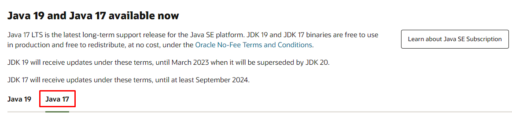

3) Selecione o Mac como sistema operacional e faça o download.

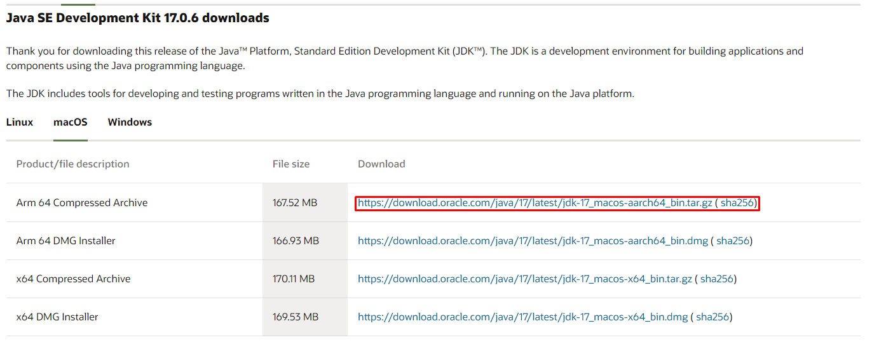

### Windows

1) Para instalar no Windows, podemos acessar o site da Oracle ou buscar no navegador por “Java Download Oracle” e acessar o primeiro link.

2) Agora, precisamos escolher a versão do Java. Neste curso vamos utilizar o Java 17 LTS, por ser a versão de suporte de longo prazo mais recente para a plataforma Java SE.


3) Selecione o Windows como sistema operacional e faça o download.

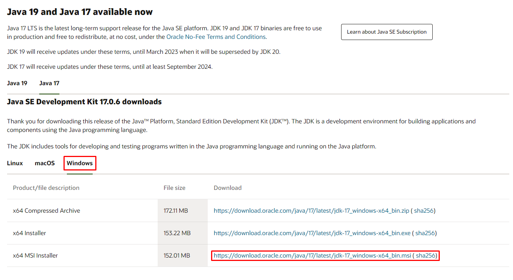

4) Após baixado, vamos executar o instalador e prosseguir com a instalação.

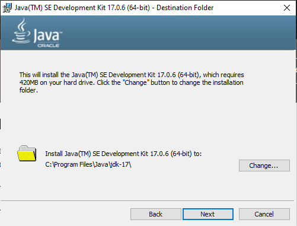
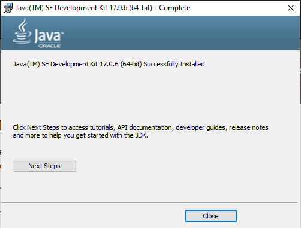

## Instalação do IntelliJ

Utilizaremos a IDE IntelliJ, da empresa JetBrains.

Precisamos entrar na página principal do IntelliJ, onde encontraremos algo parecido com a imagem abaixo. Vamos clicar no botão "Baixar":


Após clicar nesse botão, seremos levados à página de downloads da ferramenta, que apresenta opções para os sistemas Windows, Linux e MacOS em um menu que deve ser clicado baseado em seu sistema operacional. Logo abaixo do menu vemos duas opções de download, que se tratam das duas versões da IDE: a edição Ultimate e Community.

A versão Ultimate apresenta mais recursos, como suporte a mais linguagens e gerenciamento de banco de dados embutido, no entanto é paga; A edição Community é a opção gratuita da ferramenta e apresenta todos os recursos que vamos precisar durante o curso, por este motivo vamos instalar esta versão.

Para fazer o download o IntelliJ Community Edition, vamos clicar no botão "Baixar" como apresentado na imagem abaixo:
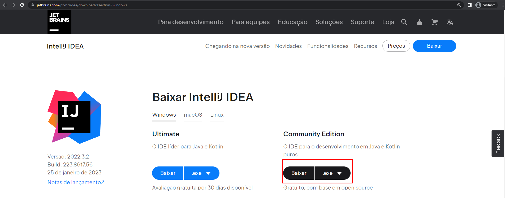

Após clicar em "Baixar", será feito o download da ferramenta e sua instalação varia com o sistema operacional.

### Windows

No Windows será baixado o instalador da ferramenta, com nome similar a "ideaIC-2022.3.2", dependendo da versão baixada. Para iniciar a instalação, vamos executar esse arquivo.

Após executado, vai ser aberta uma janela de instalador padrão do Windows, como na imagem abaixo, onde vamos clicar no botão "Next":
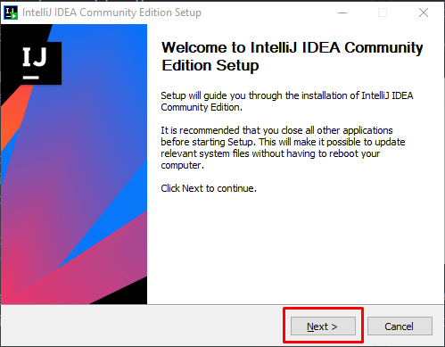

Que vai nos direcionar para uma página onde vamos selecionar em qual pasta será feita a instalação. Aqui nós podemos deixar no diretório padrão e novamente clicar no botão "Next", como mostrado abaixo:
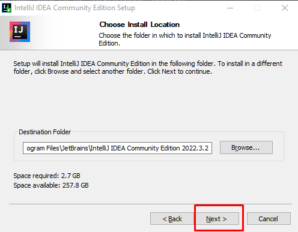

Após isso, seremos direcionados para uma tela com várias caixas de seleção, com opções de instalação da ferramenta. São opções referentes à se queremos criar um atalho no desktop, adicionar o IntelliJ ao PATH, para que possa ser acessado via linha de comando, adicionar uma nova ação ao menu de contexto, para que quando clicarmos em um arquivo com o botão direito do mouse aparece a opção de abri-lo no IntelliJ, e criar associações aos tipos de arquivo, para que eles sejam abertos diretamente na IDE.

Aqui podemos selecionar todas as caixas, como na imagem:
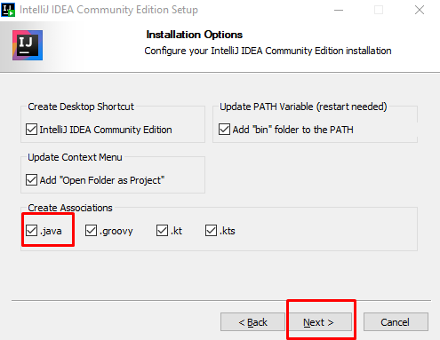

Caso você não queira marcar todas as caixas, a mais importante é na aba "Create Associations", onde vamos criar as associações dos arquivos ```.java``` ao IntelliJ, como destacado na imagem acima. Após marcar as opções desejadas, podemos seguir clicando no botão "Next".

Após isso, vamos para a seleção da pasta do menu iniciar onde poderemos localizar a nossa IDE. Nessa tela podemos simplesmente deixar a opção padrão e clicar no botão "Install" para instalar a ferramenta no computador, como mostrado abaixo:
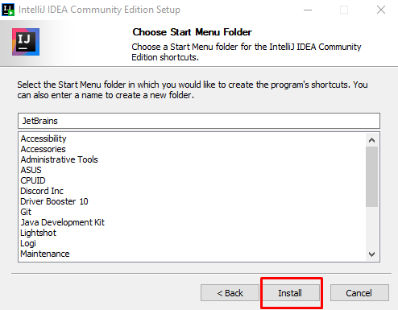

Será iniciada a instalação dos arquivos da ferramenta, o que pode demorar um tempinho. Hora de pegar um café e esperar!

Ao final da instalação, seremos direcionados a uma tela com a opção de reiniciar o computador agora ou depois. É recomendável reiniciar o computador, para que as alterações no PATH funcionem corretamente, no entanto a ferramenta já pode ser utilizada mesmo sem a reinicialização.

Por fim, podemos clicar no botão "Finish", para finalizar o instalador, como na imagem abaixo:
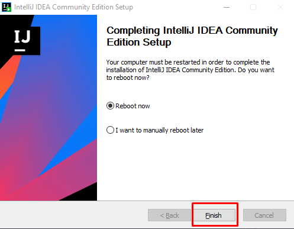

### Linux

Em sistemas Linux, o arquivo baixado é um arquivo compactado já com a IDE pré-instalada. Para conseguir executá-la, precisamos navegar até a pasta onde o arquivo baixado está e descompactá-lo com o comando:

```
tar -xf <arquivoBaixado>.tar.gz
```

O nome do arquivo pode variar conforme a versão baixada, mas sempre segue um padrão como "ideaIC-2022.3.2.tar".

Após descompactar o arquivo, será criada uma pasta com nome similar a "idea-IC-xxx.xxx.xx" onde os "x" representam a versão da ferramenta. Para abrir a IDE, é necessário navegar até a pasta, através do comando:

```
cd idea-IC-xxx.xxx.xx
```

E acessar a subpasta "bin", a partir do comando:

```
cd bin
```

Onde está localizado o arquivo "idea.sh", que é o script de inicialização do IntelliJ. Agora, para abrir a IDE basta rodar o script com o comando:

```
./idea.sh
```

Que vai inicializar a ferramenta que já está pronta para ser utilizada!

### MacOS

No MacOS, assim como no Windows, é baixado um instalador com a instalação ".dmg" e a instalação é bastante simples.

Para isso, vamos navegar até a pasta de download do arquivo e executá-lo com duplo clique. Será aberta uma janela pedindo para que o ícone do IntelliJ seja arrastado até o ícone da pasta Applications, como mostrado na imagem:
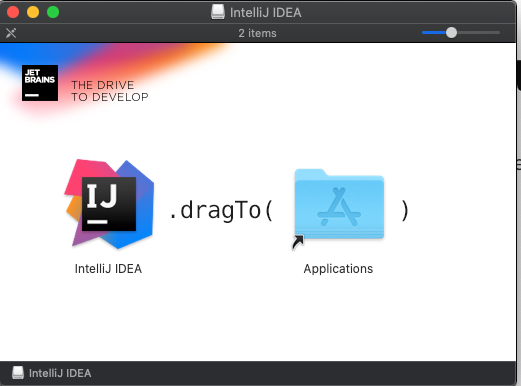

Após arrastar, vai ser iniciado o processo de cópia de arquivos e a IDE será instalada. Ao término da instalação basta pesquisar no menu de pesquisa por "IntelliJ" e executar o programa "IntelliJ IDEA CE”.

## Instalação do Postman

Utilizaremos o Postman como ferramenta para testes da API. Caso você não o tenha instalado em seu computador, confira nesse [artigo](https://www.alura.com.br/artigos/postman-como-instalar-dar-seus-primeiros-passos?_gl=1*1fi1gj6*_ga*NjQ1Njk4MDc3LjE2ODkxNzI4NjE.*_ga_59FP0KYKSM*MTY4OTI0ODkwMy40LjEuMTY4OTI2NDU3NS4wLjAuMA..*_fplc*JTJCVzJSOWtWbktwcXhQJTJCUkRMdHc0U2FjeUFsWHRTRTlwTE1KQVFTN0RuQ3JRY3NXeCUyQlJVZGpsVzZsQUNNd0xQT0JHQzZjY1NsZG9vUHZqZzgybE1WU1ByWWdwTEc0M3UwTXFRaWJ4JTJGM0xqZDBHckU1RUZlaUJ4ZExLa0ZFcXclM0QlM0Q.) sobre como realizar a instalação do Postman.

## Instalação do MySQL

Utilizaremos o MySQL como banco de dados da aplicação. Caso você não o tenha instalado em seu computador, confira nesse [artigo](https://www.alura.com.br/artigos/mysql-do-download-e-instalacao-ate-sua-primeira-tabela?_gl=1*1s0gnss*_ga*NjQ1Njk4MDc3LjE2ODkxNzI4NjE.*_ga_59FP0KYKSM*MTY4OTI0ODkwMy40LjEuMTY4OTI2NDU3NS4wLjAuMA..*_fplc*JTJCVzJSOWtWbktwcXhQJTJCUkRMdHc0U2FjeUFsWHRTRTlwTE1KQVFTN0RuQ3JRY3NXeCUyQlJVZGpsVzZsQUNNd0xQT0JHQzZjY1NsZG9vUHZqZzgybE1WU1ByWWdwTEc0M3UwTXFRaWJ4JTJGM0xqZDBHckU1RUZlaUJ4ZExLa0ZFcXclM0QlM0Q.) sobre como realizar a instalação do MySQL.
