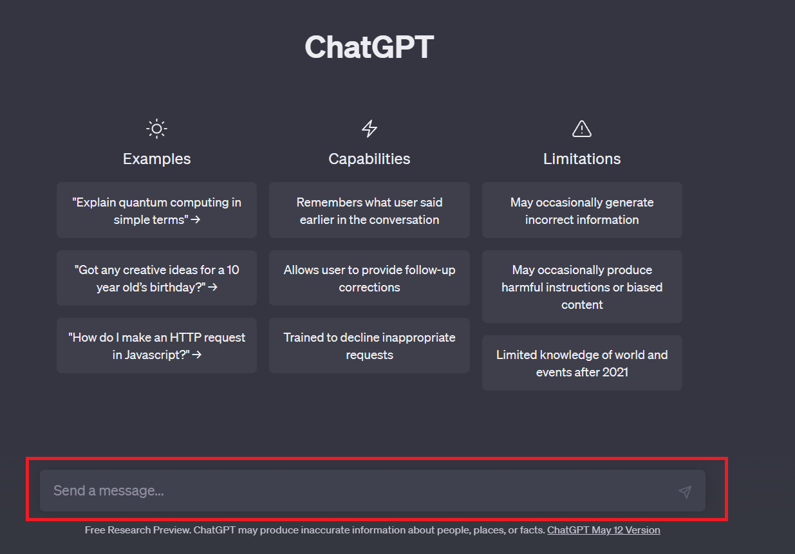

# Compreendendo as limitações do ChatGPT - Por que nem sempre as respostas são precisas?

Você já passou pela situação em que fez uma pergunta ou deu uma instrução para que o ChatGPT executasse uma tarefa, mas o resultado não foi exatamente o que você esperava?

Essa é uma situação bastante comum entre as pessoas usuárias de inteligências artificiais generativas, uma vez que nem sempre é fácil expressar com precisão o que se deseja. Além disso, você pode ter notado que pequenas alterações na formulação do que escrevemos podem levar a respostas significativamente diferentes, dificultando a obtenção de consistência nos resultados - a consistência nos resultados nos garante uma maior estabilidade nas respostas, evitando variações ou contradições significativas.

Essas perguntas ou instruções que fazemos são chamadas de prompts.

Quando abrimos o ChatGPT há uma caixinha na parte inferior da página onde está escrito “Send a message” (enviar uma mensagem):

É exatamente nesta caixa que nós conseguimos escrever o que queremos enviar para que uma resposta seja retornada. Então, um prompt nada mais é do que uma instrução ou uma entrada fornecida a um modelo de linguagem, como o ChatGPT, para orientar sua geração de texto.

É uma forma de solicitar ao modelo que produza uma resposta ou texto relevante com base na informação fornecida. Os prompts desempenham um papel crucial na interação com o modelo, permitindo que os usuários forneçam direcionamentos específicos para as respostas que desejam obter.

Mas por que os resultados dos prompts nem sempre são bons?

Segundo, a OpenAI o ChatGPT possui algumas limitações:

- Às vezes, o ChatGPT escreve respostas plausíveis, mas incorretas ou sem sentido. Isso ocorre porque o modelo é treinado com base em grandes quantidades de texto da internet, mas nem todas as informações nesses dados são precisas. Portanto, o modelo pode ocasionalmente produzir respostas incorretas ou inventar informações.

  - O ChatGPT também é sensível a ajustes nos prompts ou às tentativas da mesma solicitação várias vezes. Por exemplo, você pode escrever algo e o modelo pode afirmar que não sabe a resposta, mas se você fizer alguma reformulação no prompt a resposta pode vir de forma correta. Ou se você utilizar o mesmo prompt várias vezes as respostas podem não ser consistentes.
  - O modelo também pode ser prolixo e usar demais certas frases. Esses problemas surgem de viéses nos dados de treinamento e problemas de super otimização.
Além disso, o ChatGPT tem limitações em sua capacidade de memória e contexto. O modelo leva em consideração apenas uma quantidade limitada de texto anterior ao gerar uma resposta. Isso significa que se a tarefa exigir informações ou referências anteriores específicas, o modelo pode não conseguir acessá-las adequadamente. Isso pode levar a respostas inconsistentes ou que parecem ignorar completamente o histórico da conversa.

Por fim, o modelo pode sofrer com problemas de viés e gerar respostas que podem ser imprecisas e tendenciosas, devido à natureza dos dados de treinamento usados e à maneira como eles foram coletados.

Por isso, é fundamental que ao utilizar o ChatGPT, sejam adotadas estratégias que maximizem o potencial do modelo e garantam resultados mais precisos e confiáveis. Neste curso, você irá aprender algumas dessas estratégias e poderá utilizá-las na sua interação com o ChatGPT para obter respostas mais adequadas e relevantes para as suas necessidades.
