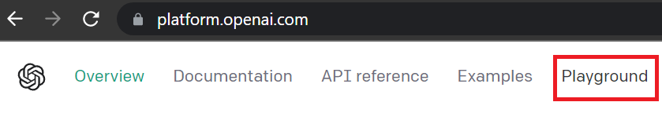

# O que é a OpenAI Playground?

## Conhecendo o Playground

A OpenAI Platform é uma plataforma online desenvolvida pela OpenAI que permite às pessoas usuárias experimentarem e explorarem os modelos de linguagem da OpenAI de maneira interativa. É um ambiente onde você pode interagir com o modelo de linguagem, fazendo perguntas e recebendo respostas geradas pelo modelo em tempo real.

Essa plataforma é voltada para pessoas desenvolvedoras, cientistas de dados, empresas e profissionais de IA que desejam aproveitar os recursos avançados. Para acessá-la é necessário fazer o login na página OpenAI platform.

A plataforma engloba diferentes produtos e ferramentas criados pela OpenAI para ajudar na criação e implantação de aplicativos baseados em inteligência artificial. Aqui vamos falar sobre um desses recursos disponíveis: O Playground. Para acessá-lo basta clicar no botão “Playground” na parte superior da página:

Após clicar em Playground teremos acesso a página mostrada na figura abaixo. Com a opção “Mode”(Modo) sendo “Chat”, temos no lado esquerdo uma caixa chamada “System”, com a seguinte mensagem “You are a helpful assistent” (Você é um assistente útil). No centro da tela há o “User”, com a mensagem “Enter a user message here” (Digite uma mensagem de usuário aqui) e um botão com sinal positivo (+) para adicionar uma mensagem. Na parte inferior há um botão “Submit” (Submeter) em verde. Por fim, no lado direito temos várias opções de configurações.

Na interface do OpenAI Playground, no modo “Chat” (bate-papo), existe a opção de escrever um prompt do sistema no campo "System" (sistema). Essa é uma forma de separar e especificar as tarefas que você deseja que sejam executadas pelo modelo de linguagem. O campo "User" (usuário) é onde você pode inserir o texto a ser trabalhado ou até mesmo código, permitindo que você separe os conteúdos caso sua instrução e seu texto sejam longos. Essa separação facilita o entendimento do modelo e ajuda a obter resultados mais precisos.

É possível escolher qual modelo queremos utilizar na configuração “Model” (modelo). Para quem não é assinante do ChatGPT versão Plus, só haverá o modelo 3.5 disponível. Além disso, existem algumas configurações disponíveis no Playground que vamos discutir daqui a pouco: Temperature (Temperatura), Maximum lenght (Comprimento máximo), Top P, Frequency penalty (Penalidade de frequência) e Presence penalty ( Penalidade de presença).

Com esses recursos, o Playground permite que as pessoas usuárias insiram prompts de texto, modifiquem parâmetros e observem as respostas do modelo, tornando-o um excelente ambiente para trabalhar e obter respostas otimizadas e gerar automatizações.

É importante ressaltar que o Playground a princípio é gratuito, mas tem um limite de tempo de aproximadamente 3 a 4 meses. No momento, quando você se inscreve em uma conta na OpenAI, recebe automaticamente um crédito inicial de $18, que permite a geração de cerca de 650.000 palavras para você. No entanto, assim que atingir o limite de tempo ou os créditos se esgotarem você não consegue enviar mensagens, a não ser que você pague para utilizar.

## Ajustando as configurações

No Playground é possível controlar os resultados dos prompts ajustando algumas configurações que nós não conseguimos controlar utilizando apenas o ChatGPT. Sabe aquele problema de a cada vez que você roda um prompt o resultado não sai igual? Existe uma configuração que pode resolver esse problema e ela é chamada de temperatura.

Quando nós deixamos a temperatura definida igual a 0 no playground, o modelo sempre retornará conclusões idênticas ou muito semelhantes. Por outro lado, se você aumentar a temperatura, os resultados não serão tão parecidos. Por isso, quando a temperatura está acima de 0, enviar o mesmo prompt resulta em conclusões diferentes a cada vez.

E por que isso acontece? O modelo prevê qual texto tem maior probabilidade de seguir o texto que o precede e a temperatura é um valor entre 0 e 2 que basicamente permite controlar a confiança do modelo ao fazer essas previsões. A redução da temperatura significa que haverá menos riscos e as conclusões serão mais precisas e determinísticas. Já o aumento da temperatura resultará em conclusões mais diversas.

Além da temperatura, podemos modificar outros parâmetros. O Maximum Length define o comprimento máximo que uma resposta pode ter. Se você definir um número limite, o modelo irá interromper a geração de texto assim que atingir esse limite de caracteres. Isso é útil para controlar a extensão das respostas geradas e evitar resultados muito longos.

Já o Top P, também conhecido como Nucleus Sampling, é uma técnica que controla a diversidade das respostas, considerando apenas as probabilidades das palavras mais prováveis. Ao definir um valor para o Top P, como 1, por exemplo, o modelo seleciona as palavras mais prováveis até atingir uma probabilidade acumulada de 100%. Isso evita que o modelo gere respostas muito raras ou improváveis.

Também temos o Frequency Penalty, uma configuração que controla a repetição de tokens em uma resposta. Definir um valor mais alto para a penalidade de frequência incentiva o modelo a evitar repetições excessivas e produzir respostas mais variadas.

Por fim, o Presence Penalty é a configuração que controla a preferência do modelo por incluir ou evitar informações específicas nas respostas. Quando você aumenta o valor do Presence Penalty, o modelo tem uma tendência maior de evitar mencionar palavras ou frases que você forneceu como instrução (prompt). Isso significa que o modelo tentará gerar respostas que não incluam explicitamente as informações fornecidas. Por outro lado, ao diminuir o valor do Presence Penalty ou defini-lo como zero, o modelo terá mais liberdade para incluir as informações fornecidas nas respostas. Isso pode levar a respostas mais diretas e que mencionam explicitamente o que você pediu.

A configuração Presence Penalty pode ser útil quando você deseja que o modelo gere respostas mais criativas, evitando ser excessivamente dependente das informações fornecidas. No entanto, é importante observar que, em alguns casos, especialmente quando as instruções são mais longas ou complexas, um valor alto de Presence Penalty pode fazer com que o modelo ignore completamente as informações fornecidas.

Essas configurações permitem personalizar o comportamento do modelo de linguagem de acordo com suas necessidades e ajustar o equilíbrio entre criatividade, coerência, extensão das respostas e outras características desejadas.

É importante ressaltar que a OpenAI Platform é um conjunto de serviços e ferramentas em constante evolução, então novos recursos e produtos podem ser adicionados à plataforma ao longo do tempo. Por isso, é recomendável dar uma checada no site da OpenAI ou na documentação oficial para obter informações atualizadas sobre os recursos disponíveis na OpenAI Platform. Fique à vontade para explorar tudo o que a plataforma tem a oferecer!
