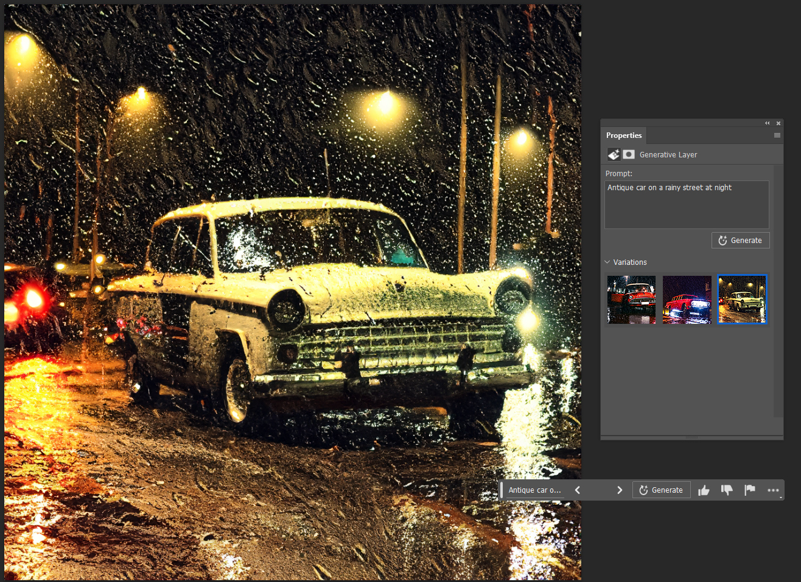
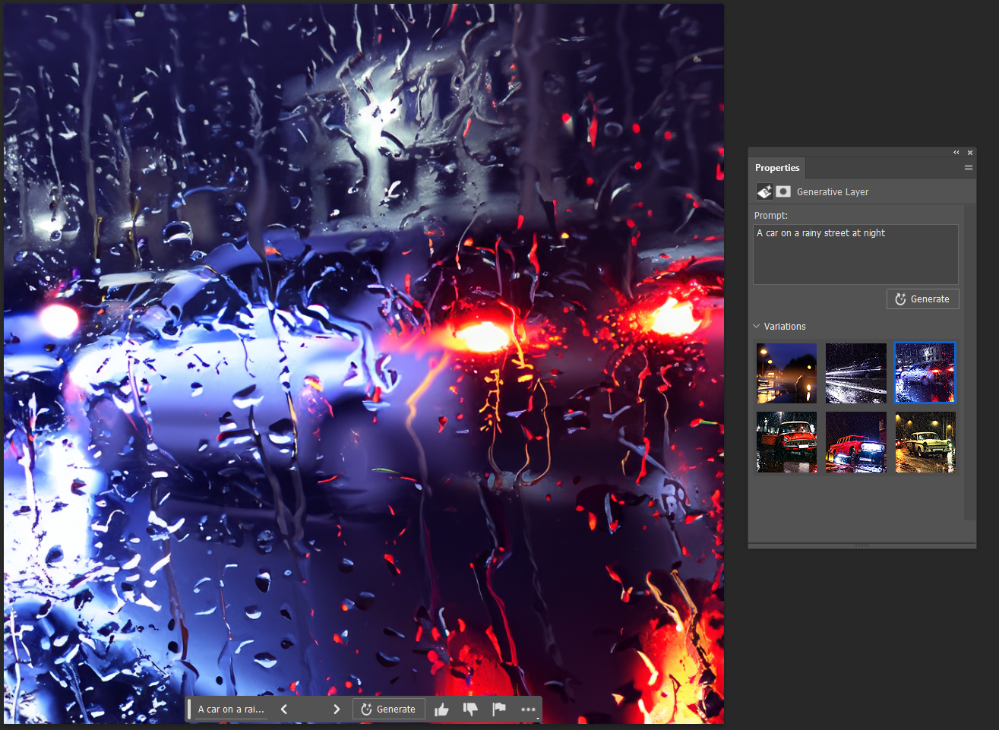

# Como as imagens são criadas

A ferramenta Generative Fill do Photoshop usa a inteligência artificial da Adobe chamada Firefly. Como elas são feitas, exatamente?

A IA cria imagens totalmente originais com base no que é descrito em um prompt de texto. Ou seja, ela não captura seções de imagens existentes e as junta para criar uma nova composição. Em vez disso, usando o que aprendeu com a leitura de milhões de fotos, o sistema inventa novas cenas e novos objetos para corresponder ao que ele entende que o texto significa. Assim, o nível de detalhes do que for escrito é que vai determinar a assertividade do resultado.

Um prompt como “carro antigo em uma rua chuvosa à noite” monta uma imagem de uma massa aleatória de pixels para corresponder ao que o sistema entende como “carro”, “chuva”, “rua” e “noite’'.

Uma cena com um carro antigo numa noite chuvosa, 100% criada pela IA do Photoshop. Se você estiver procurando imagens mais genéricas, o prompt deve ser menos preciso.

Remover o termo “antigo” nos entrega outros tipos de carros. Portanto, lembre-se de incluir todas (e apenas) as informações necessárias para o programa trabalhar. E não se esqueça que os comandos de instrução não funcionam, pelo menos até o momento.

E diferente de demais IA generativas de imagens, que consultam toda a internet para referências, o Firefly usa o banco de imagens da Adobe como base de consulta e para o seu próprio machine learning. Deste modo, as criações acontecem dentro do ambiente de imagens licenciadas pela própria Adobe, sem correr o risco de plagiar outros criadores.

## Por que a IA gera resultados diferentes para o mesmo prompt?

Porque esses sistemas utilizam uma técnica chamado de tokenização. A tokenização é a primeira etapa no pré-processamento de dados de texto para aprendizado de máquina e tarefas de NLP (Processamento de linguagem natural, em inglês).

De maneira simplificada, ela envolve a divisão de um documento de texto em unidades menores chamadas “tokens”, que podem ser palavras, frases ou caracteres individuais. O objetivo da tokenização é encontrar uma pequena representação de texto que faça mais sentido para um modelo de aprendizado de máquina. No caso do Photoshop e outras ferramentas de imagem, cria uma relação entre texto e imagem.

Desse jeito, o Firefly pega a informação que você inseriu - ou seja, o prompt - e a deixa cada vez menor (em formato de tokens) para guardá-la sem usar muito espaço. Depois, ele a revisita e incorpora os "adereços" à informação, que são substantivos e adjetivos que compõem a imagem. Durante essa etapa de reorganização dos tokens em uma imagem que faça sentido a partir do prompt, o resultado pode variar.
