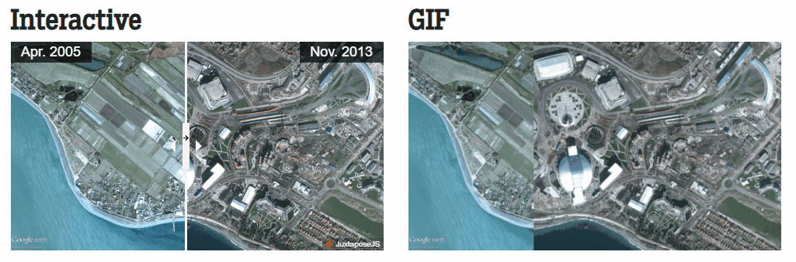

# Ferramentas para incrementar o seu projeto

Após finalizar os seus projetos de design é interessante entender se faz sentido eles serem divulgados, levando em conta os seus objetivos profissionais. Se fizer sentido, algumas ferramentas online podem te ajudar a incrementar visualmente as suas entregas. Vamos ver algumas delas a seguir:

[LeiaPix](https://convert.leiapix.com/)
Plataforma que trabalhamos no último vídeo e que converte as suas imagens 2D em animações com profundidade, reproduzindo a sensação de tridimensionalidade. O acesso é gratuito, é necessário apenas cadastrar um perfil.

[JuxtaposeJS](https://juxtapose.knightlab.com/)
Sistema que constrói imagens do tipo “antes e depois”, a partir de transições que podem ser automáticas ou interativas. Você pode criar tanto GIFs quanto gerar gerar links a serem incorporados à uma página web, como o seu perfil no Behance.

À esquerda, um exemplo de transição interativa e à direita uma imagem GIF, com transição automática.

[MyHeritage](https://www.myheritage.com.br/deep-nostalgia)
Esta página anima as suas fotos. Basta apenas fazer o carregamento no site que a IA faz todo o resto sozinha.

Esta ferramenta é especialmente útil para projetos que tenham como destaque ou elemento protagonista o rosto de uma pessoa.
