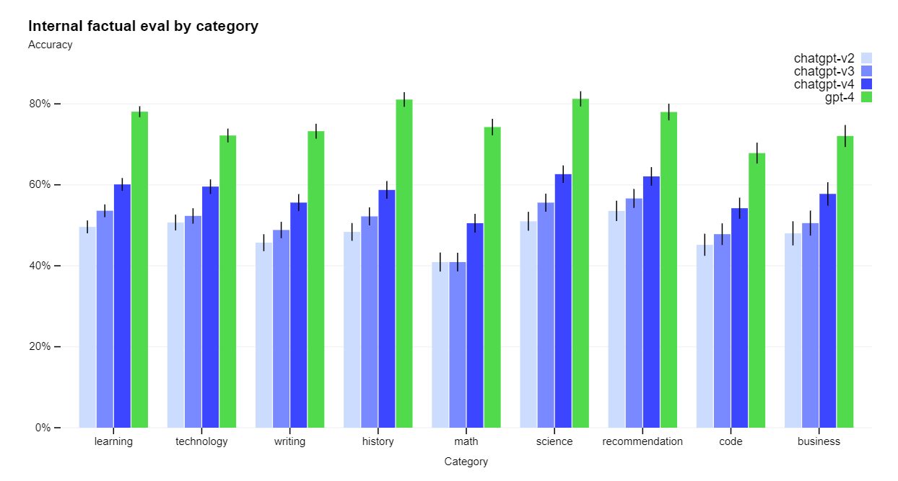

# ChatGPT 3.5 vs ChatGPT 4 - Qual é a diferença?

Nos vídeos anteriores nós testamos alguns prompts em duas versões do ChatGPT: versão 3.5 e 4.

Foi possível notar que os resultados são diferentes para cada uma das versões e que as respostas geradas pela versão 4 são lentas quando comparadas a versão anterior. Como a versão 4 é mais complexa que sua versão anterior, o tempo de resposta para gerar as respostas pode ser significativamente maior. Isso significa que, embora as respostas geradas pela versão 4 sejam mais precisas e relevantes, elas podem levar mais tempo para serem geradas do que as respostas da versão 3.5.

E qual é a diferença entre as versões? O que mudou na versão 4?

Segundo a OpenAI o GPT-4, lançado em março de 2023, é o sistema mais avançado da OpenAI até o momento, produzindo respostas mais seguras e úteis. Porém, essa versão até o momento só está disponível na opção de assinatura mensal chamada Plus.

Além das respostas mais seguras, a empresa diz que o GPT-4 está mais criativo e colaborativo do que nunca. Ele pode gerar, editar e interagir com os usuários em tarefas de redação criativa e técnica, como compor músicas, escrever roteiros ou aprender o estilo de escrita de um usuário.

Além disso, o GPT-4 é um grande modelo multimodal (aceitando entradas de imagem e texto, emitindo saídas de texto) que, embora menos capaz que os humanos em muitos cenários do mundo real, exibe desempenho de nível humano em vários benchmarks profissionais e acadêmicos.

É importante mencionar que a OpenAI dedicou seis meses para aprimorar a segurança e alinhamento do GPT-4, conforme informado pela própria empresa. As avaliações internas da empresa mostram que o GPT-4 tem 82% menos probabilidade de responder a solicitações de conteúdo proibido e 40% mais chances de produzir respostas corretas do que o GPT-3.5.

Apesar de suas capacidades, o GPT-4 tem limitações semelhantes aos modelos GPT anteriores. Mais importante, ainda não é totalmente confiável (ele “alucina” fatos e comete erros de raciocínio). Porém, embora ainda seja um problema real, o GPT-4 reduz significativamente as alucinações, em relação aos modelos anteriores. Alucinações, nesse contexto, se referem à geração de respostas que aparentam ser verdadeiras, mas que podem ser falsas ou com pouca confiabilidade.

Na figura a seguir, temos a acurácia do ChatGPT em nove categorias:

- aprendizagem
- tecnologia
- escrita
- história
- matemática
- ciências
- recomendação
- código
- negócios

O GPT-4 (em verde) foi comparado com as três primeiras versões do ChatGPT, mostrando que há ganhos significativos em todos os tópicos.

O modelo básico GPT-4, assim como os modelos anteriores da série GPT, foi criado para prever a próxima palavra em um documento e treinado com base em dados disponíveis publicamente, bem como dados licenciados pela OpenAI. Esses dados de treinamento incluem várias soluções corretas e incorretas para problemas matemáticos, raciocínios fracos e fortes, afirmações auto contraditórias e consistentes, representando uma ampla variedade de ideologias e ideias.

É importante ressaltar que quando uma pessoa usuária faz uma pergunta, o modelo básico pode fornecer várias respostas que podem estar um pouco distantes da intenção original da pessoa. No entanto, a versão 4 do ChatGPT apresenta respostas mais precisas e relevantes do que a versão 3.5, embora possa ter um tempo de resposta mais lento devido à sua maior complexidade.
