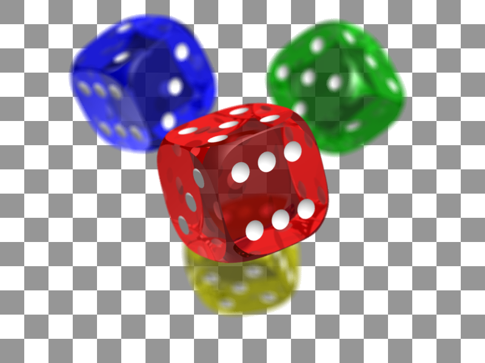
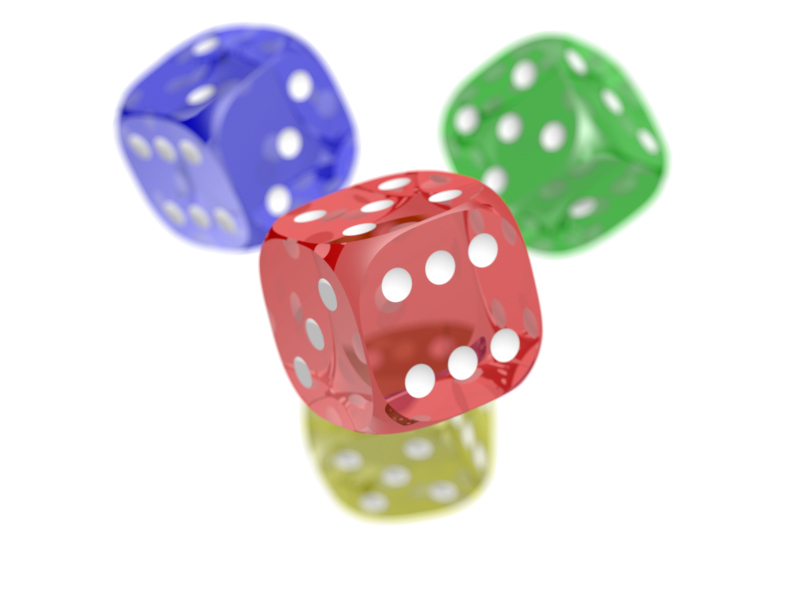

# Formatos de imagem

Para saber mais vamos ver em detalhes o formatos de imagem PNG e JPG

## PNG

As imagens PNG suportam o canal alfa, que trata das transparências. Se você desejar que o fundo seja branco, é preciso que crie um objeto por trás do elemento a ser exportado e então conclua a ação.

A malha quadriculada é uma representação para a ausência de fundo.

As principais características deste tipo de imagem são:

### Vantagens

- Compressão sem perdas: os softwares não descartam muitos pixels para reduzir o tamanho do arquivo final;
- É possível salvar transparências; e
- Ótimo para texto e capturas de tela.

### Desvantagens

- Tamanho de arquivo maior que outro formato popular de imagem, o JPG;
- Nenhum suporte EXIF nativo (não exibe informações como velocidade do obturador, abertura e ISO da câmera com a qual foi capturado).

## JPG

Diferentemente do PNG, ele não suporta transparências. O fundo aqui sempre será preenchido por alguma cor que, caso não seja selecionada, será a branca.

As imagens JPG não possuem o canal Alfa, que viabiliza a transparência. Dessa forma, elas sempre terão um fundo, mesmo que branco, como nesse exemplo acima.

As propriedades mais importantes deste formato são:

### Vantagens

- Tamanho de arquivo pequeno, ideal para utilização web;
- Suporte EXIF integrado; e
- Amplamente suportado.

### Desvantagens

- Compressão com perda de qualidade: os softwares descartam alguns pixels para reduzir o tamanho do arquivo;
- Não é possível salvar transparências; e
- Não é bom para impressão CMYK por não suportar bem este modo de cores.
