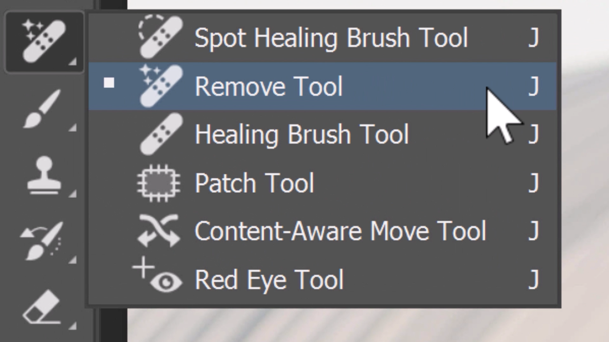
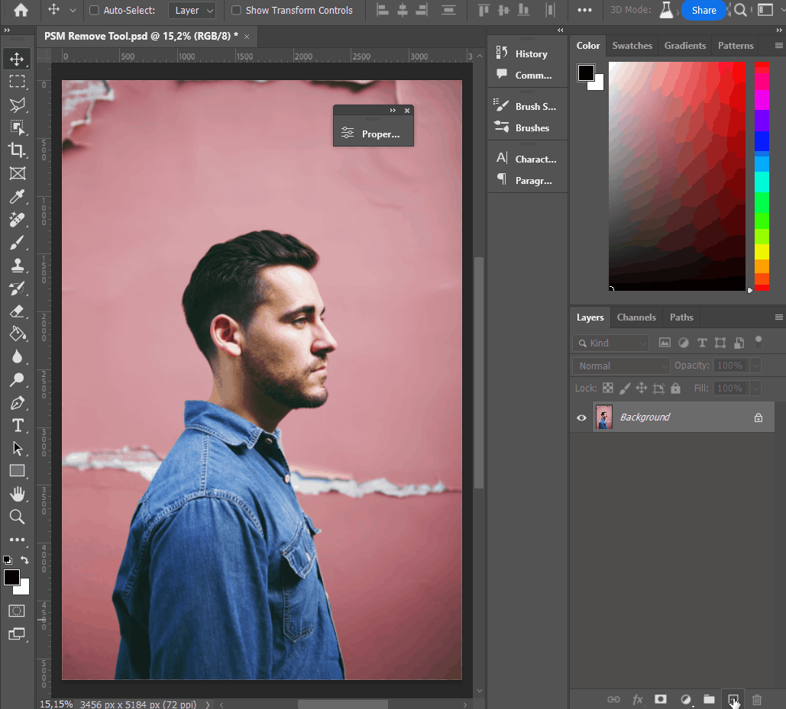
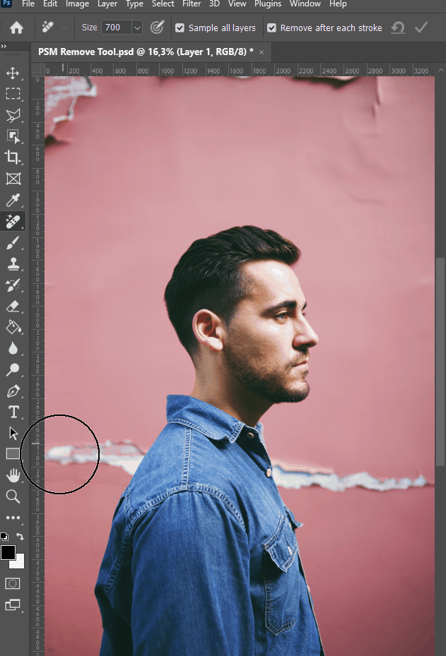

# Remove tool, o futuro da edição

No vídeo anterior trabalhamos com a ferramenta Remove do Photoshop, lançada na versão 24.5 do programa. É uma grande adição ao software, que revoluciona a maneira como certas edições são feitas. Trata-se de uma ferramenta com inteligência artificial que remove magicamente qualquer coisa de uma foto no Photoshop. Ela pode lidar com tudo se você quiser remover: uma garrafa de água, uma bolsa ou até mesmo uma pessoa em segundo plano. E a melhor parte? É incrivelmente fácil de usar.

Você encontra a ferramenta Remove aninhada ao grupo da ferramenta *Spot Healing Brush*.

Se você não a vir, clique no ícone de três pontos e redefina a barra de ferramentas para o padrão.

Na sequência, para trabalhar de forma não-destrutiva, crie uma nova camada. Dessa forma, as correções serão feitas numa camada separada, sem alterar a imagem original. Para que a ferramenta funcione, é preciso habilitar a opção Sample all Layers, para o Photoshop extrair informações de todas as camadas do documento e não apenas a camada atual (que está vazia).

Depois, use o pincel para sinalizar o que deseja remover. A opção Remove after each stroke, que por padrão está habilitada, vai fazer com que no momento em que você solte o mouse o programa processe a edição. Na imagem acima, para remover as rachaduras na parede, então, é preciso efetuar duas “pinceladas”: uma para cada lado do modelo. O ideal é que parte da figura que não será removida também seja incluída na pincelada, para que o Photoshop consiga “pensar” com mais facilidade.

Com o parâmetro Remove after each stroke desabilitado é possível realizar diversas pinceladas e, após estar satisfeito, executar a remoção pressionando a tecla Enter.

## E o que faz a Remove Tool ser tão especial?

Você pode estar se perguntando o que diferencia a ferramenta Remove das ferramentas mais antigas do Photoshop, como a Spot Healing Brush ou o Content-Aware Fill. A resposta é simples: tecnologia de aprendizado de máquina.

A tecnologia sensível ao conteúdo funciona por meio da amostragem de pixels ao redor e misturando e preenchendo a área. Ele faz um ótimo trabalho em fundos consistentes. A ferramenta de remoção do Photoshop foi projetada para lidar com tarefas mais desafiadoras. Ele lida melhor com fundos e bordas complexas e preserva a profundidade da imagem.

## Dicas para usar a Remove Tool

Use toques curtos ou cliques únicos em vez de longos.
Mantenha o tamanho da ponta do pincel pequeno para manter a precisão.
Se a ferramenta Remover não fornecer os resultados desejados, simplesmente pinte o objeto novamente até obter algo com o qual esteja satisfeito.
