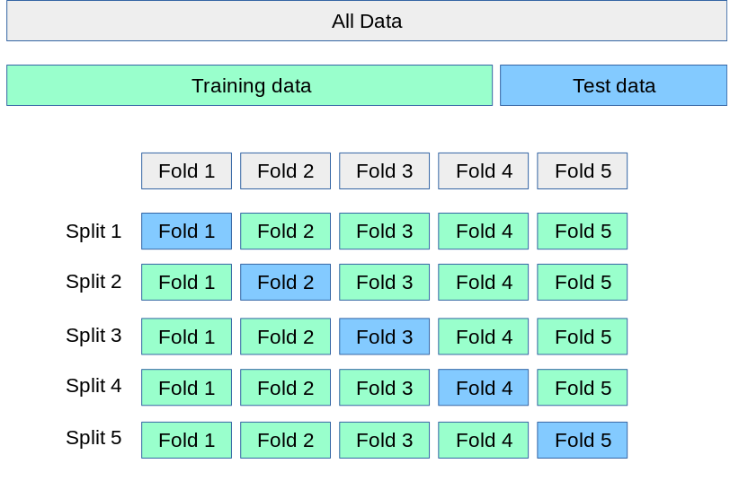

# Como funciona a validação cruzada?

Acabamos de realizar a validação cruzada, mas vamos nos aprofundar um pouco mais nesse assunto?

Abaixo temos um prompt escrito com essa finalidade, onde também pedimos para que seja diferenciado os métodos K-Fold Cross-Validation e Stratified K-Fold Cross-Validation:

``` 
Explique o que é validação cruzada em Machine learning.
Além disso, diferencie “K-Fold Cross-Validation“ de “Stratified K-Fold Cross-Validation”.
```

O resultado:

A validação cruzada (cross-validation) é uma técnica utilizada em machine learning para avaliar o desempenho de um modelo de forma mais robusta e confiável. Em vez de simplesmente dividir o conjunto de dados em apenas um conjunto de treinamento e um conjunto de teste, a validação cruzada envolve dividir o conjunto de dados em várias partes (chamadas de folds) e executar o processo de treinamento e teste em cada uma dessas partes. Essa divisão em conjuntos de treinamento e teste pode ser feita de várias maneiras, sendo o K-Fold Cross-Validation e o Stratified K-Fold Cross-Validation duas abordagens comumente utilizadas.

No **K-Fold Cross-Validation**, o conjunto de dados é dividido em K partes iguais (chamadas de folds ou dobras). O modelo é treinado K vezes, cada vez usando K-1 folds como conjunto de treinamento e 1 fold como conjunto de teste. O desempenho do modelo é calculado como a média dos resultados obtidos em cada iteração.

Já no **Stratified K-Fold Cross-Validation**, a divisão dos dados em folds é feita de forma a preservar a proporção de classes em cada fold. Isso é especialmente útil quando se lida com problemas de classificação em que as classes não estão balanceadas no conjunto de dados. O objetivo é garantir que cada fold represente adequadamente a distribuição de classes do conjunto de dados original.

Em resumo, enquanto o K-Fold Cross-Validation divide o conjunto de dados em partes iguais, o Stratified K-Fold Cross-Validation leva em consideração a distribuição de classes ao realizar essa divisão. Ambas as abordagens são úteis para avaliar o desempenho de modelos de machine learning e escolher os melhores hiperparâmetros, mas o Stratified K-Fold Cross-Validation é mais recomendado quando se lida com classes desbalanceadas.

Para fornecer uma explicação mais clara sobre a validação cruzada, podemos utilizar uma figura adaptada da documentação da biblioteca sklearn. Nessa figura, temos uma representação visual do processo de validação cruzada. A figura começa mostrando o conjunto de dados completo em cinza. Em seguida, uma porção maior dos dados é separada em verde para ser usada como conjunto de treinamento, enquanto uma porção menor é destacada em azul como conjunto de teste. Essa é a abordagem que utilizamos anteriormente, onde treinamos os modelos com parte dos dados e realizamos as predições com a porção de teste. Depois disso, a figura apresenta 5 blocos em cinza, denominados Fold 1, Fold 2, Fold 3, Fold 4 e Fold 5. Esses blocos representam a divisão dos dados em partes chamadas de "folds" na validação cruzada.



A validação cruzada realiza o processo em etapas, em que cada parte dos dados é utilizada como conjunto de teste uma vez, enquanto as outras partes são usadas para treinamento. Isso é ilustrado na figura pelos splits. No primeiro split, o Fold 1 é usado como conjunto de teste, enquanto os Folds 2, 3, 4 e 5 são utilizados como conjunto de treinamento. Em seguida, no segundo split, o Fold 2 é usado como teste e os outros folds como treinamento. Esse processo se repete até que todos os splits tenham sido realizados.

Essa abordagem de dividir os dados em folds e realizar múltiplos splits nos permite obter estimativas mais robustas do desempenho do modelo, pois avaliamos seu desempenho em diferentes conjuntos de teste. Dessa forma, podemos ter uma visão mais confiável de como o modelo se comporta em dados não vistos.
