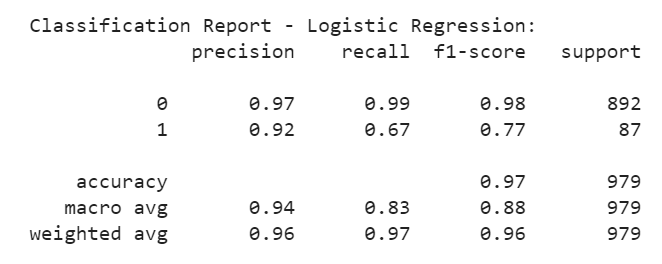

Para obter uma compreensão mais aprofundada da classificação dos nossos modelos, utilizamos várias métricas, que foram calculadas usando a função classification_report da biblioteca sklearn. Para o modelo de regressão logística, por exemplo, obtivemos o seguinte resultado:



Vamos entender como essas métricas são calculadas? O prompt abaixo pode nos auxiliar nisso:

    Explique como são calculadas as métricas obtidas com a função “classification_report” da biblioteca sklearn.

O resultado é o seguinte:

A função classification_report da biblioteca sklearn é usada para calcular várias métricas de avaliação para um problema de classificação. Essas métricas incluem precisão (precision), recall (recall), F1-score (f1-score) e suporte (support) para cada classe.

Aqui está uma explicação detalhada de como essas métricas são calculadas:

**Precisão (Precision):** A precisão é calculada como a razão entre o número de verdadeiros positivos (VP) e a soma dos verdadeiros positivos e falsos positivos (FP). Em termos matemáticos, a fórmula da precisão é:

*Precisão = VP / (VP + FP)*

A precisão mede a proporção de exemplos positivos classificados corretamente em relação a todos os exemplos classificados como positivos. Ela fornece uma indicação da confiabilidade das previsões positivas.

**Recall (Recall):** O recall, também conhecido como taxa de verdadeiros positivos, é calculado como a razão entre o número de verdadeiros positivos (VP) e a soma dos verdadeiros positivos e falsos negativos (FN). A fórmula do recall é:

*Recall = VP / (VP + FN)*

O recall representa a proporção de exemplos positivos corretamente classificados em relação a todos os exemplos que deveriam ter sido classificados como positivos. Ele mede a capacidade do modelo em encontrar todos os exemplos positivos.

**F1-score (F1-Score):** O F1-score é uma média harmônica ponderada de precisão e recall, combinando essas duas métricas em uma única medida. É calculado usando a fórmula:

*F1-score = 2 * (Precisão * Recall) / (Precisão + Recall)*

O F1-score fornece uma medida balanceada da precisão e do recall, levando em consideração tanto os falsos positivos quanto os falsos negativos. É útil quando há um desequilíbrio significativo entre as classes.

**Suporte (Support):** O suporte é simplesmente a contagem de exemplos de cada classe presente no conjunto de dados de teste. Ele mostra quantas instâncias pertencem a cada classe.

Essas métricas são calculadas para cada classe individualmente e também podem ser calculadas para uma média ponderada (média micro) ou não ponderada (média macro) de todas as classes.

O *classification_report* da biblioteca *sklearn* gera uma tabela que apresenta essas métricas para cada classe e também as médias ponderadas e não ponderadas. Essas métricas nos fornecem informações valiosas sobre o desempenho do modelo em termos de precisão, recall e F1-score para cada classe, ajudando-nos a avaliar a qualidade das previsões.

O ChatGPT trouxe todas as fórmulas para o cálculo dessas métricas, mas acabou não trazendo o cálculo para a acurácia. A métrica de acurácia é uma medida fundamental utilizada em problemas de classificação e representa a taxa de acertos do modelo em relação ao total de exemplos do conjunto de dados. Então, a acurácia é calculada como a razão entre o número de predições corretas (verdadeiros positivos e verdadeiros negativos) por todas as predições. A fórmula para o cálculo da acurácia é a seguinte:

```
Acurácia = (VP + VN) / (VP + VN + FP + FN)
```

Podemos visualizar como esses cálculos são feitos pensando na matriz de confusão. A acurácia é obtida somando-se o número de verdadeiros positivos (VP) e verdadeiros negativos (VN) e dividindo-o pelo total de exemplos, representado pela soma de VP, VN, FP (falsos positivos) e FN (falsos negativos). Portanto, a acurácia nos fornece uma medida geral do desempenho do modelo em termos de predições corretas, permitindo avaliar sua eficácia em relação ao conjunto total de exemplos.

Abaixo temos a matriz de confusão e a fórmula da acurácia:


E quanto à precisão? Na próxima figura, apresentamos a representação da matriz de confusão, na qual apenas VP (verdadeiros positivos) e FP (falsos positivos) são utilizados no cálculo:


Por fim, temos a matriz de confusão que indica que VP (verdadeiros positivos) e FN (falsos negativos) são utilizados para calcular o recall (revocação):


Excelente! Conseguimos entender a matemática por trás do Classification report (relatório de classificação). No entanto, ainda temos outra medida importante a ser calculada em um modelo de classificação: a curva ROC (Receiver Operating Characteristic). Traduzindo para o português essa sigla quer dizer Característica de Operação do Receptor.

A curva ROC é uma ferramenta amplamente utilizada para avaliar o desempenho de modelos de classificação binária em diferentes limiares de probabilidade. Essa curva representa a taxa de verdadeiros positivos (TPR) em função da taxa de falsos positivos (FPR) para vários pontos de corte ou limiares.

A partir dos cálculos da TPR e FPR, podemos plotar a curva ROC. Quanto mais próxima a curva ROC estiver do canto superior esquerdo do gráfico, melhor será o desempenho do modelo, indicando uma maior capacidade de distinção entre as classes.

Além da curva ROC, também é comum calcular a área sob a curva ROC (ROC AUC), que fornece uma medida resumida do desempenho do modelo. Quanto maior o valor da ROC AUC (variando de 0 a 1), melhor é o desempenho do modelo em distinguir entre as classes.
